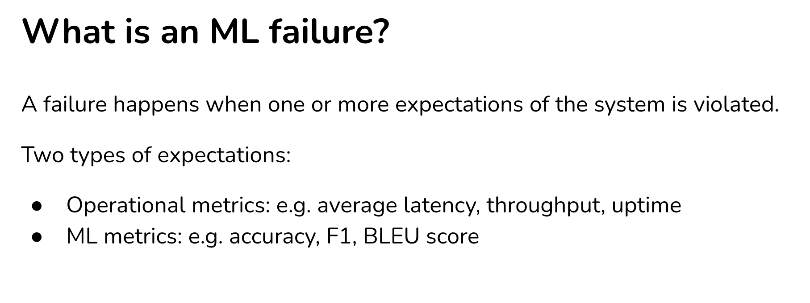
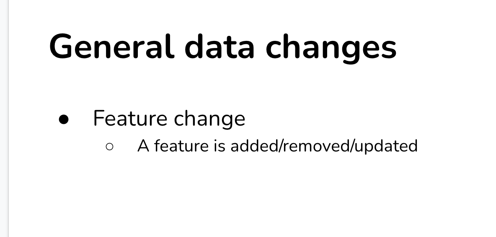
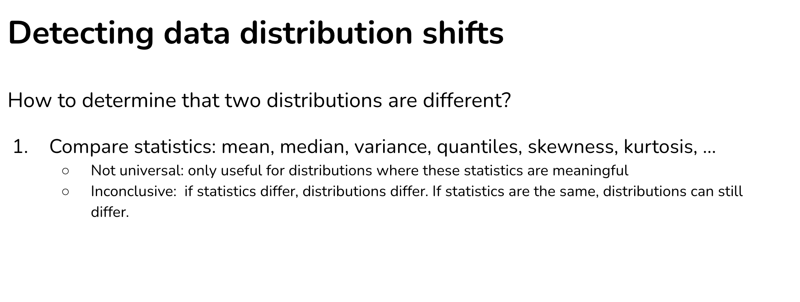
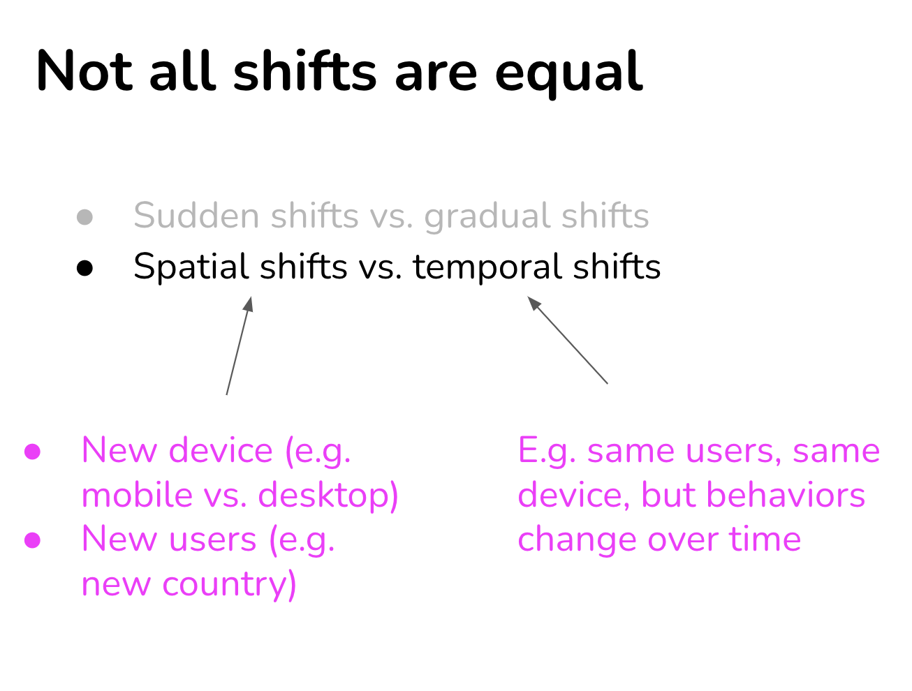

# Ref

docx : https://docs.google.com/document/d/14uX2m9q7BUn_mgnM3h6if-s-r0MZrvDb-ZHNjgA1Uyo/edit#heading=h.2p8lce0bcck

pptx : https://docs.google.com/presentation/d/1tuCIbk9Pye-RK1xqiiZXPzT8lIgDUL6CqBkFSYZXkbY/edit#slide=id.g112c1e99806_0_529


# ML Failure Diagnosis

## Natural lavels

Label 和斯斯一樣分 3 種，手標標籤(hand label)、自然標籤(natural label)、透過程式碼所產生的標籤(programmic label)

</img>

</img>

</img>

## Delayed when we collecting natural labels

</img>

</img>

## Dirty labels in nature labels

</img>

</img>

# ML failure

</img>

</img>

</img>

</img>

</img>

</img>

</img>

## Edge Case

</img>

</img>

## Degenerate feedback loops

</img>

</img>

* the model prediction becmoe more homogenous.

</img>

Not only the recommendation system.

If you use nautral labels, degenerated feedback loops might happend.

</img>

if a feature importance become more important over time, it will be a suspecious feature.

</img>

## Detect degenerated feedback loops

</img>

### Randomization

</img>

</img>

* since feedback is biased (user only give feedback when the item is recommend to them)
* Tiktok push popular items(but not in prediction) to get unbiased feedback.
  * tradeoff by user experience.
  * [some math trick to avoid it - Recommendations as Treatments: Debiasing Learning and Evaluation 2016, citation 306](https://arxiv.org/pdf/1602.05352.pdf)

### Positional features

</img>

User click the item due to good recommendation or just position?

#### Naive Approach
ans : 

training : data with positional features (e.g. is_first)

inference : set all testing set (is_first = False)

might not be enough to combat degenerate feedback loops.

#### 2 models approach


</img>

design a model only predict the prob when **user saw the items**

### Data Distribution Drift

source dist : data the model trained

target dist : data the model run inference

concept from transfer learning.


</img>

* Notations
* $X$ for features, $Y$ for targets
* $P(X, Y)$ - joint distribution of features and targets (聯合機率，表達 features, targets 同時發生的機率分佈)
* $P(Y|X)$ - conditional distribution(條件機率) of targets when features are seen
  * the modeling distribution which ML models.
* training data : sampling from joint distribution

e.g. Is an email spam given the content
* $P(X)$ - email content
* $P(Y)$ - is the email spam

We can decompse $P(X, Y)$ in two ways

$P(X, Y) = P(Y|X)P(X)$ 

$P(X, Y) = P(X|Y)P(Y)$

</img>

### Covariate shift 

* Covariate - 協變量，也就是 X

</img>

</img>

</img>

Case I - Cancer detection

* **特徵集的分布變了，但特徵和 Target 的關係沒變**
* **most widely studied forms of data distribution shift**
* cancer prediction
  * you have a bias data (person who dosn't have a cancer won't see the doctor - which you collect your data)
  * production 容易誤判年紀大於 40 時，癌症風險高估
* Strategy?
  * 對齊 Source dist, Target dist
  * Source dist 不要隨機抽，要照著 Target dist 來抽


Case II - Potential VIP user detection

</img>

* New marketing campaign attracting users from with higher income
* P(income) changed (if we have such this data)
* P(convert to paid user | free user) remains the same.
* We have a biased data (income is higher)
* Strategy?

</img>


</img>

fix it by importance weighting

```
Importance weighting consists of two steps: estimate the density ratio between the real-world input distribution and the training input distribution, then weight the training data according to this ratio, and train an ML model on this weighted data
```

importance weighting : 

[paper - Rethinking Importance Weighting for Deep
Learning under Distribution Shift 2020](https://arxiv.org/pdf/2006.04662.pdf)

[github, 16 stars](https://github.com/TongtongFANG/DIW)

### Label shift

</img>

</img>


* Target 改變了，但影響 Target, Features 之間的機制並沒有改變
* **$P(x)$ changes usually leads $P(Y)$ changed, since $P(Y|X)$ ususally remains the same**

### Concept Drift

* Target 和 features 之間的機制改變了
* features 沒改變

</img>

</img>

# During Operation

</img>

</img>

## Detecting shifts

</img>

</img>

</img>

</img>

[alibi-detect](https://github.com/SeldonIO/alibi-detect)

## Type of shifts

</img>

</img>

</img>


# Retraining Policy to against shifts

</img>

</img>


# Monitoring

</img>

</img>

</img>

</img>

</img>

</img>

</img>

</img>

</img>

* [pandas-profiling](https://github.com/ydataai/pandas-profiling)
* [facets](https://github.com/PAIR-code/facets)
* [great_expectations](https://github.com/great-expectations/great_expectations)
* pydantic or attrs

# Problems when monitoring features

</img>

</img>

</img>


# Monitoring --> Continual Learning

</img>