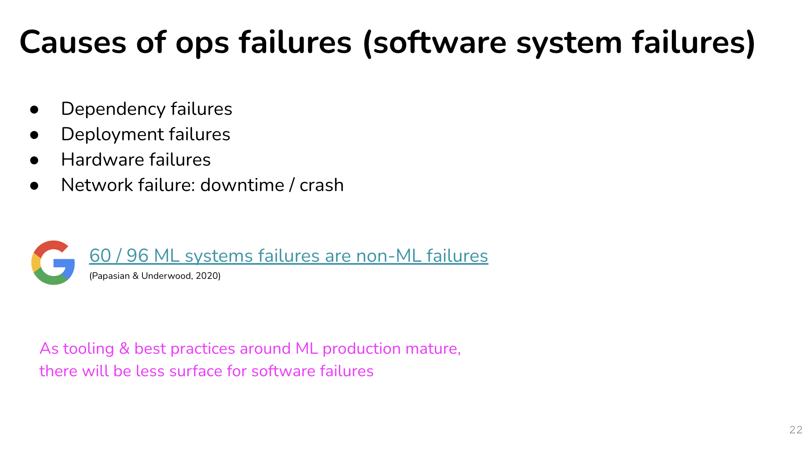

# ML Failure Diagnosis

## Natural lavels

Label 和斯斯一樣分 3 種，手標標籤(hand label)、自然標籤(natural label)、透過程式碼所產生的標籤(programmic label)

</img>

</img>

</img>

## Delayed when we collecting natural labels

</img>

</img>

## Dirty labels in nature labels

</img>

</img>

# ML failure

</img>

</img>

</img>

</img>

</img>

</img>

</img>

## Edge Case

</img>

</img>

## Degenerate feedback loops

</img>

</img>

* the model prediction becmoe more homogenous.

</img>

Not only the recommendation system.

If you use nautral labels, degenerated feedback loops might happend.

</img>

if a feature importance become more important over time, it will be a suspecious feature.

</img>

## Detect degenerated feedback loops

</img>

### Randomization

</img>

</img>

* since feedback is biased (user only give feedback when the item is recommend to them)
* Tiktok push popular items(but not in prediction) to get unbiased feedback.
  * tradeoff by user experience.
  * [some math trick to avoid it - Recommendations as Treatments: Debiasing Learning and Evaluation 2016, citation 306](https://arxiv.org/pdf/1602.05352.pdf)

### Positional features

</img>

User click the item due to good recommendation or just position?

#### Naive Approach
ans : 

training : data with positional features (e.g. is_first)

inference : set all testing set (is_first = False)

might not be enough to combat degenerate feedback loops.

#### 2 models approach

</img>

design a model only predict the prob when **user saw the items**

### Data Distribution Drift

source dist : data the model trained
target dist : data the model run inference

concept from transfer learning.

</img>

$P(Y|X) = \frac{P(X, Y)}{P(X)}$ --> $P(Y, X) = P(Y|X)P(X) = P(X|Y)P(Y)$

$P(X, Y)$ --> X, Y 同時發生

</img>

### Covariate shift

</img>

</img>

Case I - Cancer detection

* 特徵集的分布變了，但特徵和 Target 的關係沒變
* most widely studied forms of data distribution shift
* cancer prediction
  * you have a bias data (person who dosn't have a cancer won't see the doctor - which you collect your data)

Case II - Potential VIP user detection

</img>

* New marketing campaign attracting users from with higher income
* P(income) changed (if we have such this data)
* P(convert to paid user | free user) remains the same.
* We have a biased data (income is higher)
* Strategy?

</img>

fix it by importance weighting.

### Label shift

</img>

</img>

**$P(x)$ changes usually leads $P(Y)$ changed, since $P(Y|X)$ ususally remains the same**