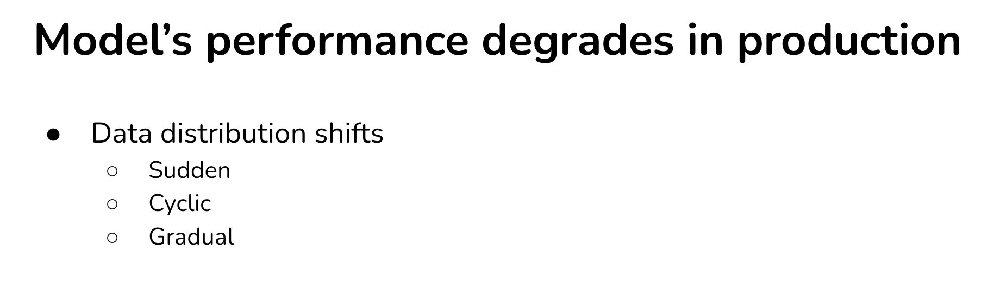
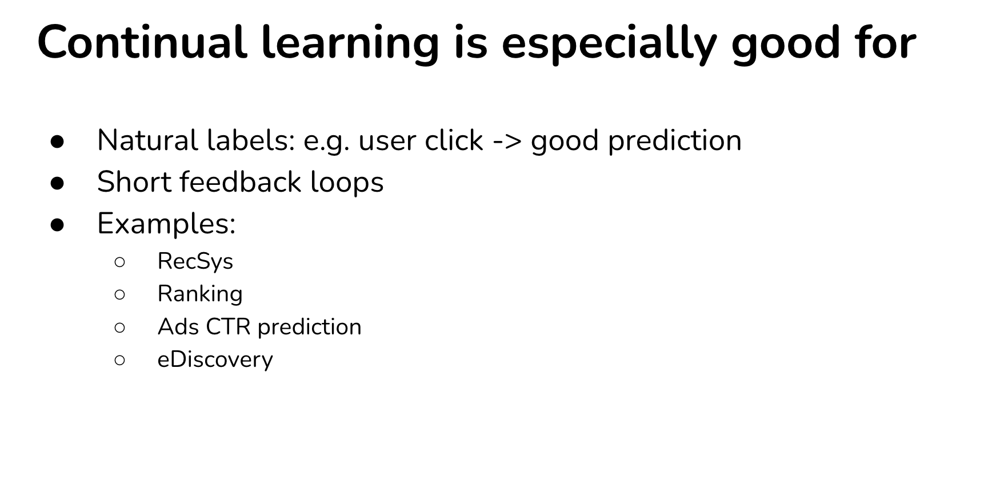
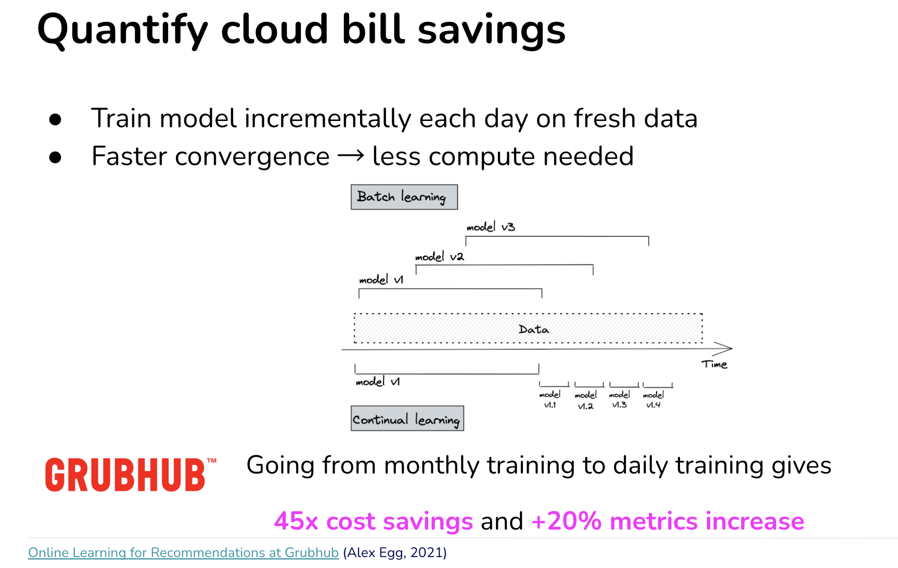
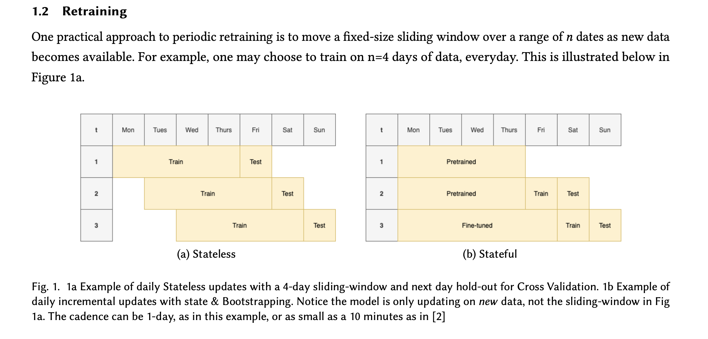
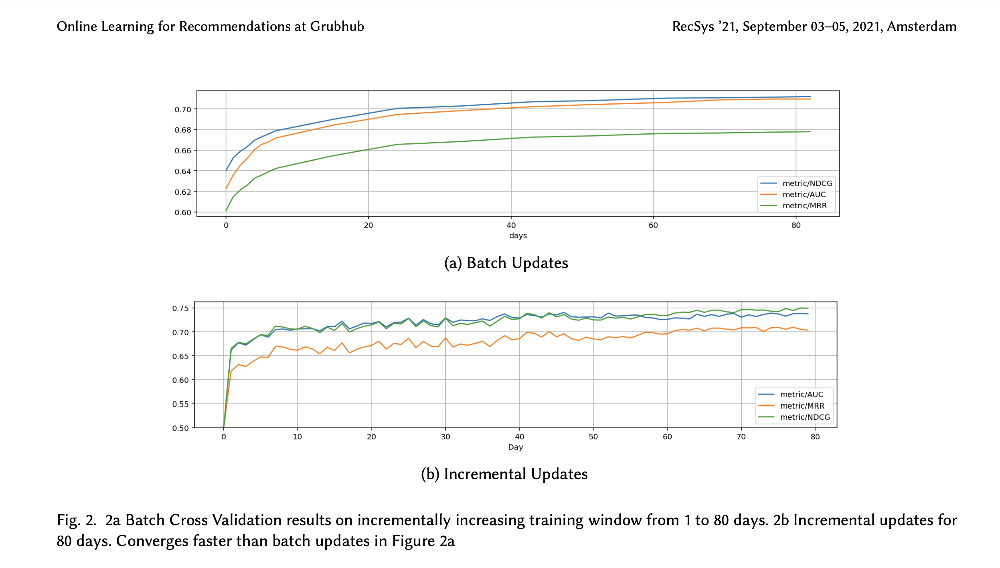
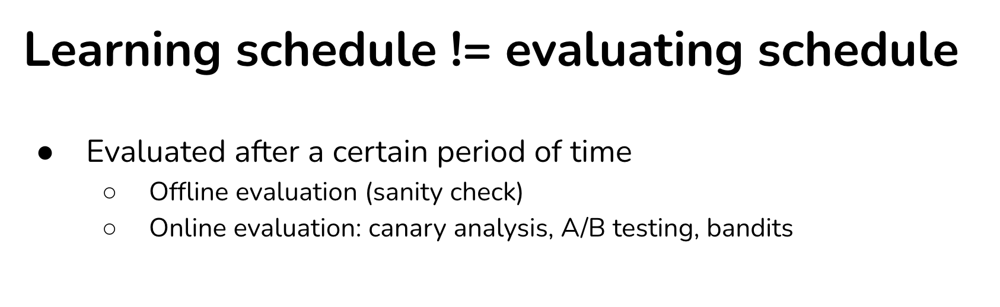

# Ref

pptx : https://docs.google.com/presentation/d/1tuCIbk9Pye-RK1xqiiZXPzT8lIgDUL6CqBkFSYZXkbY/edit#slide=id.g112c1e99806_0_529

Agenda : 

1. Continual Learning
2. Test in Production
3. Data Distribution Shift on Stream Data

# Continual Learning

</img>

</img>

</img>

</img>

</img>

## Retraining freq from monthly to weekly to daily to hourly?

</img>

</img>

[Weibo Case Study](https://www.youtube.com/watch?v=WQ520rWgd9A)

[TikTok Case Study](https://towardsdatascience.com/why-tiktok-made-its-user-so-obsessive-the-ai-algorithm-that-got-you-hooked-7895bb1ab423)

[Shein: The TikTok of Ecommerce Case Study](https://www.notboring.co/p/shein-the-tiktok-of-ecommerce)

</img>

[study](https://info.algorithmia.com/hubfs/2020/Reports/2021-Trends-in-ML/Algorithmia_2021_enterprise_ML_trends.pdf?hsLang=en-us)

</img>

[2014 - Practical Lessons from Predicting Clicks on Ads at
Facebook](https://scontent.ftpe2-2.fna.fbcdn.net/v/t39.8562-6/240842589_204052295113548_74168590424110542_n.pdf?_nc_cat=109&ccb=1-7&_nc_sid=ad8a9d&_nc_ohc=U5ri9dWzG7wAX-mZTYj&_nc_ht=scontent.ftpe2-2.fna&oh=00_AfBrvf-t6v6ENR09-ZvAo0uFQk3eCIfZ0rlSsUAR-C-KkA&oe=635F680A)

# How would retention change if you can do in-session adaptation

</img>

</img>

</img>

[Online Learning for Recommendations at Grubhub](https://arxiv.org/abs/2107.07106v1)

* Batch to micro-batch training 
  * cost saving : 45x
  * metrics : 1.2x

</img>

* Stateful retraining save cost on cloud =)

</img>

## Fast Iteration

</img>

</img>

## Test in Production

* 金絲雀部署(Canary Testing)
* A/B Testing
* 交叉實驗(Interleaved experiments)
* 影子測試(Shadow testing)

</img>

* 金絲雀部署

</img>

</img>

</img>

[best practice from google](https://cloud.google.com/architecture/application-deployment-and-testing-strategies#shadow_test_pattern)