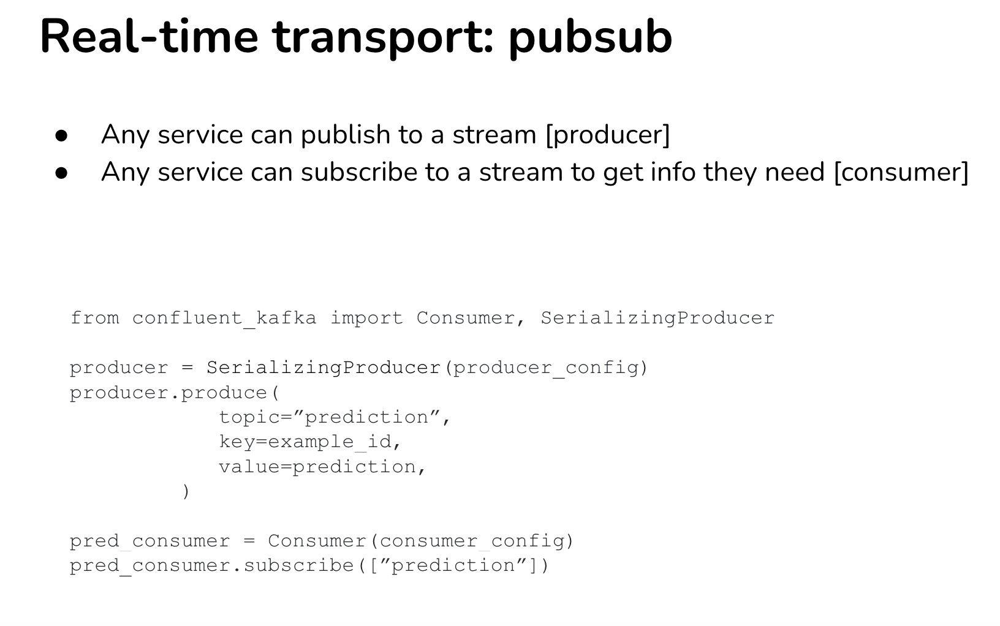
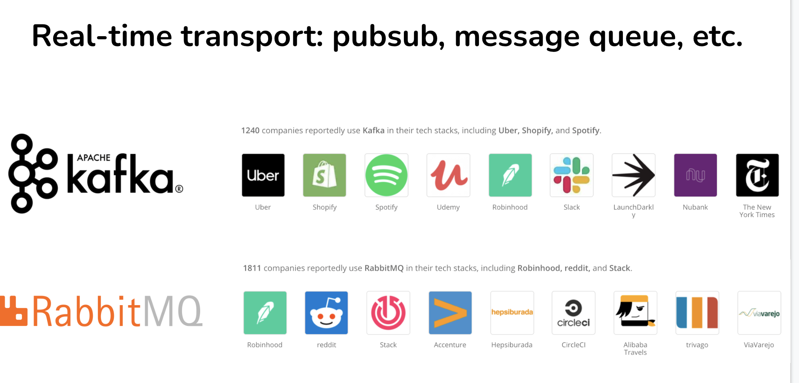
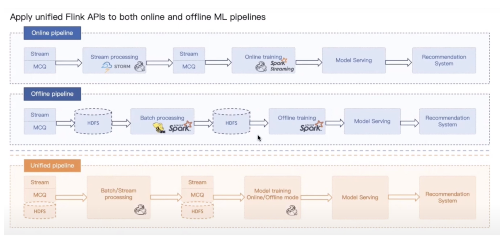
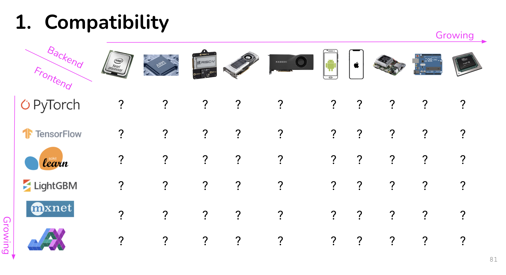
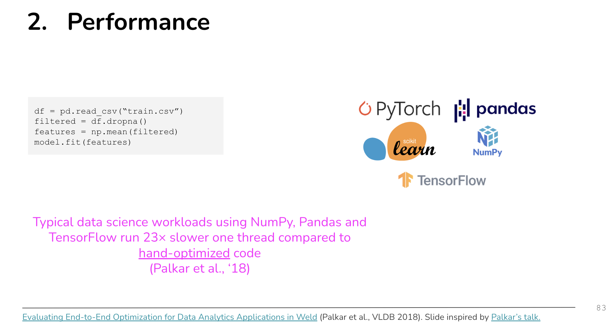
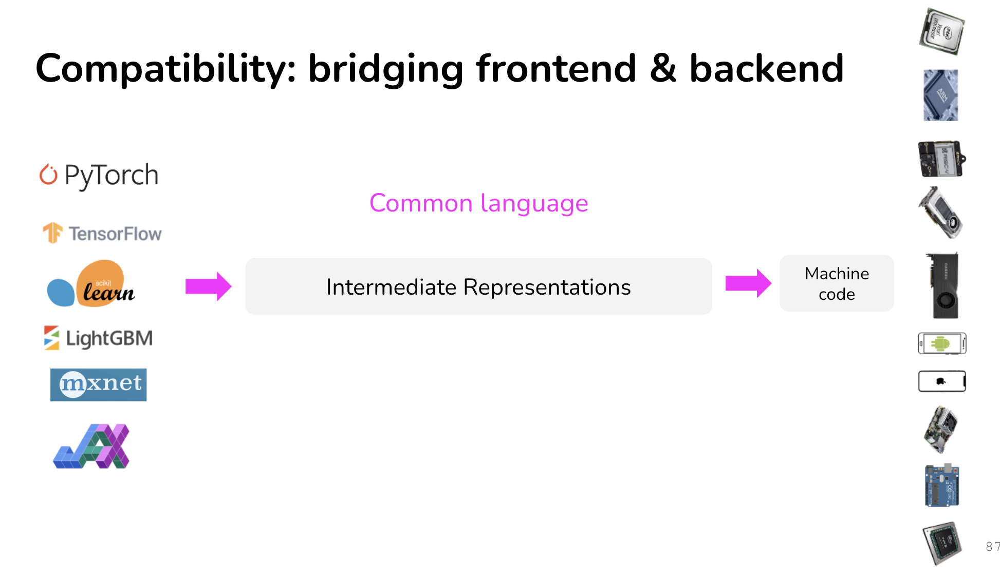

# Deplyment - Prediction Service

## Why Streamming

Bike - Sharing application

</img>

</img>

</img>

</img>

DW - 

cons : 

1. Read / Write can be slow
2. network connection could be blow up

</img>

Streamming 

cons :

1. online maintain once the system broken

</img>

## Streamming vs batch

</img>

</img>

</img>

</img>

</img>

</img>

[pyflink (kappa arct ?)](https://nightlies.apache.org/flink/flink-docs-master/zh/docs/dev/python/overview/)

</img>

</img>

## Hybird Solution

</img>

# Cloud vs Edge

</img>

</img>

</img>

</img>

</img>

</img>

[DistilBERT, a distilled version of BERT: smaller, faster, cheaper and lighter 2019](https://arxiv.org/abs/1910.01108)

</img>

</img>

## Compling & Optimizing

model / data processing tool across framework

</img>

</img>

</img>

[Evaluating End-to-End Optimization for Data Analytics Applications in Weld](http://www.vldb.org/pvldb/vol11/p1002-palkar.pdf)

</img>

</img>

</img>

## The Intermediate Representations

LLVM - numba (data processing)

</img>

</img>

for browser : 

1. [tf-js](https://www.tensorflow.org/js)
2. [synaptic - architecture-free neural network library for node.js and  the browser](https://github.com/cazala/synaptic)
3. [brain.js GPU accelerated Neural networks in JavaScript for Browsers and Node.js](https://github.com/BrainJS/brain.js)