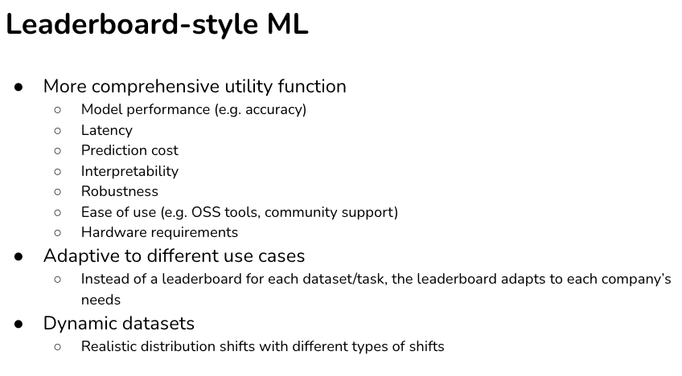
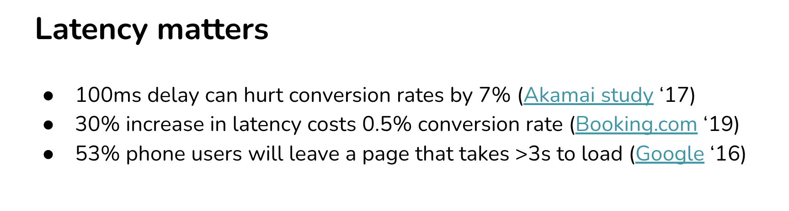
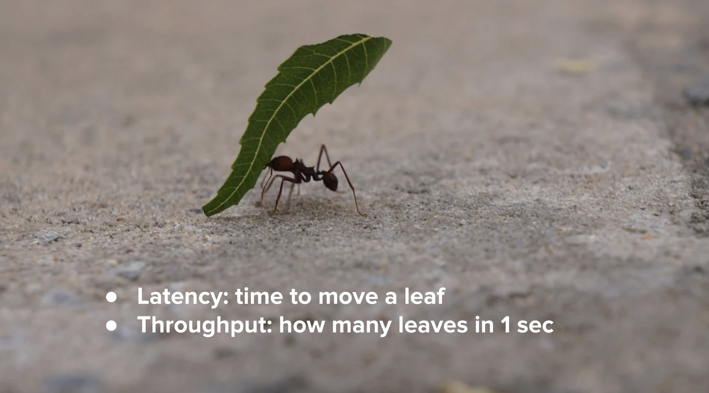
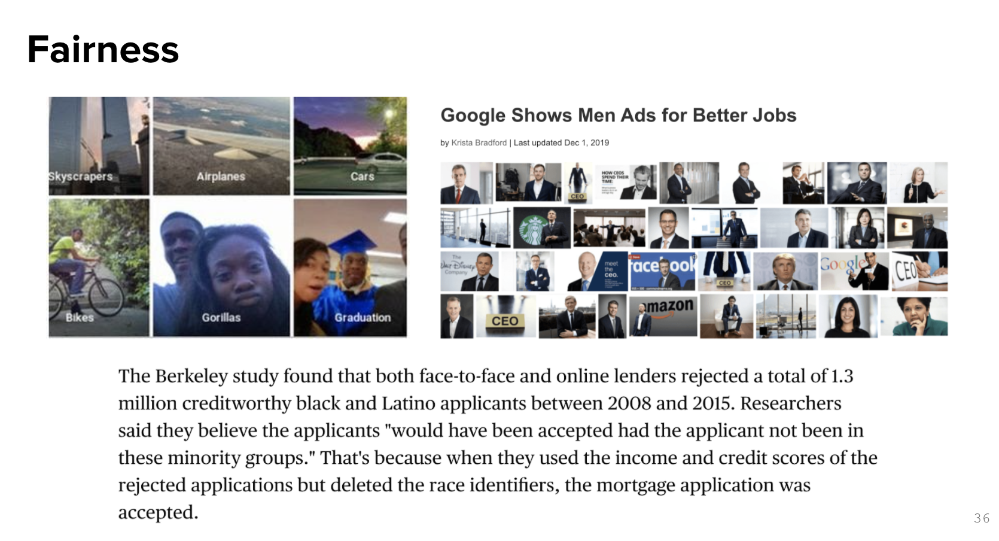

# Inderstanding ML production

[2022 slides](https://docs.google.com/presentation/u/2/d/1bhjgRelQ0O5FnYCOGiCVWg_SkfRcZ9bffQsgk6yAaL0/edit?usp=sharing)

</img>

# Stackholder Objective vs Researcher Objective

</img>

</img>

# An overview

</img>

## Latency effect the production/user experience

</img>

[Akamai 17](https://www.prnewswire.com/news-releases/akamai-online-retail-performance-report-milliseconds-are-critical-300441498.html)

[Booking 19](https://booking.ai/150-successful-machine-learning-models-6-lessons-learned-at-booking-com-681e09107bec)

[Google 16](https://www.thinkwithgoogle.com/consumer-insights/consumer-trends/mobile-site-load-time-statistics/)

</img>

</img>

## Continously Changing data

We need 

1. exception condition(when model or pipeline failed)
2. outlier detection / weired input detection(the data poison / default model behavior)
3. doamian adaption technique / active learning technique
4. data goverence skills

</img>

## Fairness is very important to the company

Gender, Age, Color, Sex, ...

</img>

## This is not a research problem =(

</img>    

## Good dimension for a leader board of ML production!

</img>

### Dynamic Dataset

</img>

[Wilds: A Benchmark of in-the-Wild Distribution Shifts 2020 stanford 87 pages!](https://arxiv.org/pdf/2012.07421.pdf)

## ML system vs traiditional software

</img>
</img>

### Data Versioning?

</img>

### Testing data

1. poison?
2. different distribution?
3. meet model assuption?
4. golden customer?

</img>

</img>

</img>

[Targeted Backdoor Attacks on Deep Learning Systems Using Data Poisoning](https://arxiv.org/pdf/1712.05526.pdf)

### Deployment...

</img>

[Targeted Backdoor Attacks on Deep Learning Systems Using Data Poisoning](https://arxiv.org/pdf/1712.05526.pdf)

### ML Myths...

</img>

</img>

</img>

</img>

</img>

[Machine learning with Flink in Weibo - Qian Yu](https://www.youtube.com/watch?v=WQ520rWgd9A&ab_channel=FlinkForward)

</img>

</img>

* 效率隨著團隊成熟度而提高

# If I wanna pick a most important one from this chapter

Leadboard of research

1. accuracy-raleted metrics

Leadboard of production

by each product/project, may be different, but frequently...

1. accuracy-raleted metrics
2. latentcy
3. prediction cost
4. interpretability
5. robustness
6. ease of use(open source software)
7. hardware requirement

what is robustness exactly?

might be - 

1. robustness against dynamics dataset(might not be a algorithm problem)
2. robustness against outlier/wired input(might not be a algorithm problem)
3. robustness against frontend datasource / backend api interface inpterruption/break

The further course we'll get deeper in it.

# Additional

https://bymiachang.com/2021/01/24/cs329s-course01-intro-ml-products-02/

