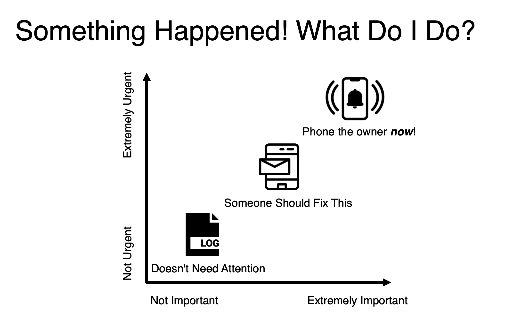
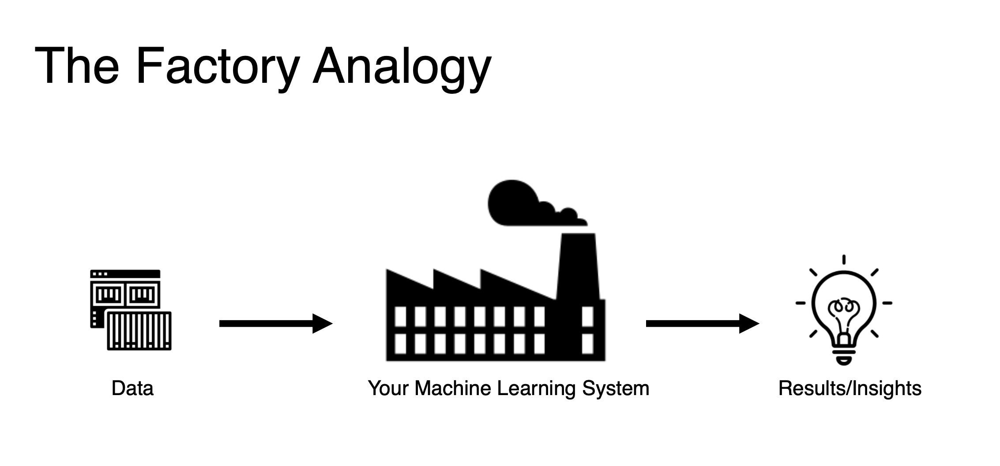
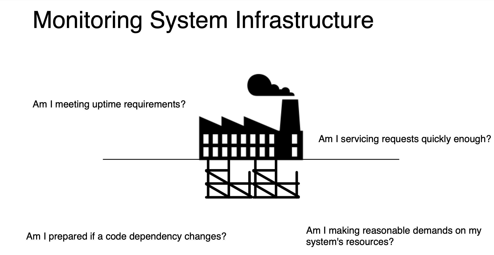
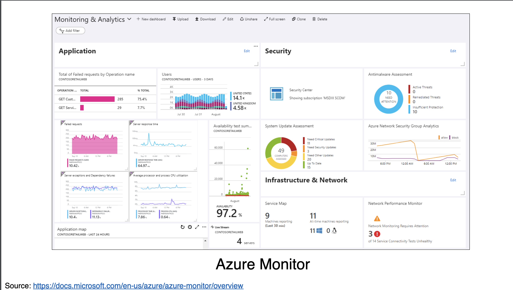
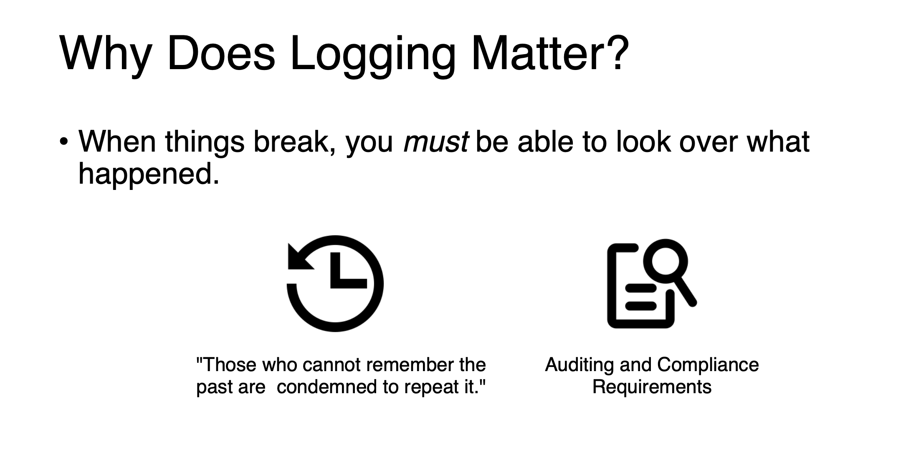
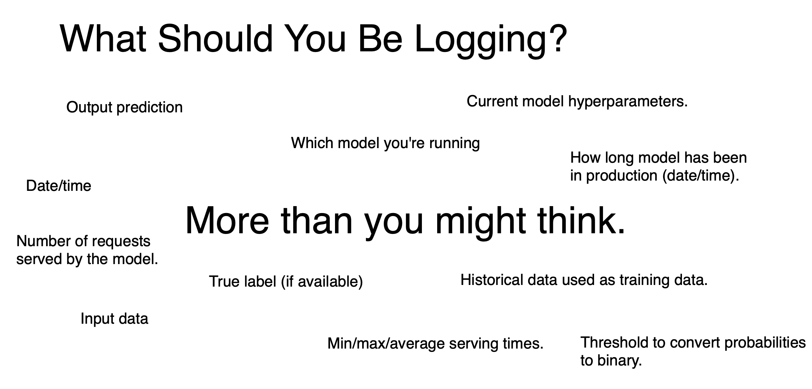

# Monitoring and Maintenance

# How can ML systems fail?

[OpML '20 - How ML Breaks: A Decade of Outages for One Large ML Pipeline from google ML engineer](https://www.youtube.com/watch?v=hBMHohkRgAA)

19 different categories

Things help us to know why our ML service is break.

1. Process orchestration issues 
2. Overloaded backedends
3. Temporary failure to join with expected data - 上游的資料表join時壞掉了
4. CPU failures
5. Cache invalidation bugs
6. Changes to the distribution of examples that we are generating inference on(例如使用者的行為改變了) - retrain as more as possible.
7. Config changes pished out of order
8. Suboptimal data structure used
9. Challenges assigning work between clusters
10. Example training strategy resulted in unexpected ordering - 預測結果不如預期
11. Configuration change not properly canaried or validated(沒有做sanity check)
12. Client made incorrect assumption about model providing inference.
13. Inference taks too long.
14. incorrect assert() in code
15. Lables weren't available/mostly correct at the time the model wisged to visit the example.
16. embeddings interpreted in the wrong embedding space.
17. QA/Test jobs incorrectly communicating with prod backends.
18. Failed to provision neceessary resouece(bandwidth, ram, CPU, GPU)

# Overview of monitoring

</img>

## Monitoring System Infrastructure

</img>

</img>

</img>

In our case in Pixnet

1. we use poetry to lock our package dependency.
2. we use airflow(composer on GCP to monitor the computing job)
3. we use app engine monitor to take care about the latency - we set auto-scaling for peak traffic.

</img>

In pixnet, we check the app engine log and composer error log to know what happend and provide us the lead.

</img>

