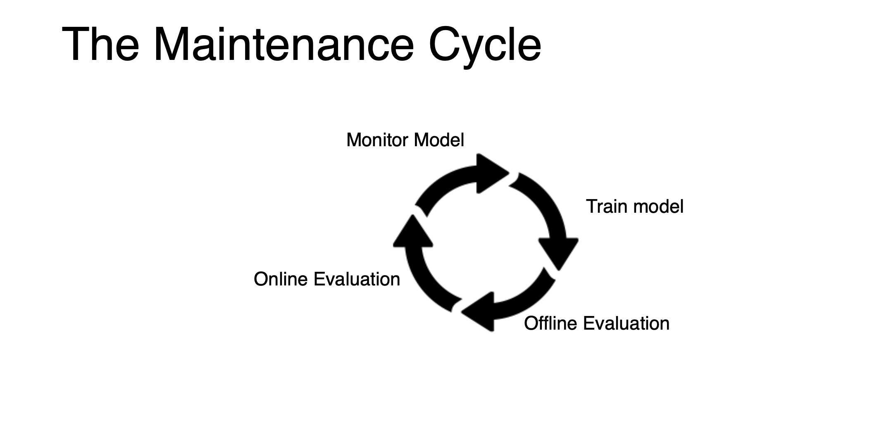
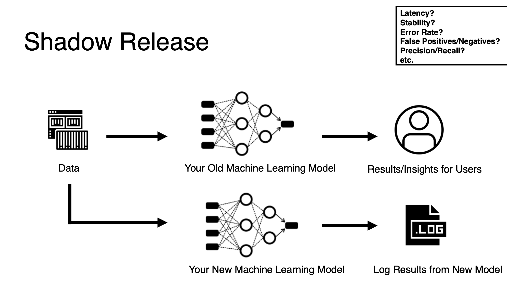

# Monitoring and Maintenance

# How can ML systems fail?

[OpML '20 - How ML Breaks: A Decade of Outages for One Large ML Pipeline from google ML engineer](https://www.youtube.com/watch?v=hBMHohkRgAA)

19 different categories

Things help us to know why our ML service is break.

1. Process orchestration issues 
2. Overloaded backedends
3. Temporary failure to join with expected data - 上游的資料表join時壞掉了
4. CPU failures
5. Cache invalidation bugs
6. Changes to the distribution of examples that we are generating inference on(例如使用者的行為改變了) - retrain as more as possible.
7. Config changes pished out of order
8. Suboptimal data structure used
9. Challenges assigning work between clusters
10. Example training strategy resulted in unexpected ordering - 預測結果不如預期
11. Configuration change not properly canaried or validated(沒有做sanity check)
12. Client made incorrect assumption about model providing inference.
13. Inference taks too long.
14. incorrect assert() in code
15. Lables weren't available/mostly correct at the time the model wisged to visit the example.
16. embeddings interpreted in the wrong embedding space.
17. QA/Test jobs incorrectly communicating with prod backends.
18. Failed to provision neceessary resouece(bandwidth, ram, CPU, GPU)

# Monitoring

</img>

## Monitoring System Infrastructure

</img>

</img>

</img>

In our case in Pixnet

1. we use poetry to lock our package dependency.
2. we use airflow(composer on GCP to monitor the computing job)
3. we use app engine monitor to take care about the latency - we set auto-scaling for peak traffic.

</img>

In pixnet, we check the app engine log and composer error log to know what happend and provide us the lead.

</img>

## Monitoring Data Pipelines

</img>

we use airflow to minitor the data dependencies

data validation - do nothing so far.

Distribution : we can use T-Test / ANOVA to detect dataset shift(the gorund-truth or the important feature values)

Or use ML to detect training/testing feature difference or not.

</img>

Or if your model is under attack?

[Detecting Adversarial Samples from Artifacts 2017](https://stanford-cs329s.github.io/slides/cs329s_13_slides_monitoring.pdf)

</img>

Also use data versioning to managing the data dependencies.(we use it in pixlake.)

</img>

Monitor the features! use less correlated feature to each other which make your algo strong.

## Monitoring Model Performance

</img>

</img>

</img>

If your label data is a esitimation of ground-truth.

</img>

lesion - 腫瘤

bengin - 良性

malignant - 惡性

</img>

</img>

Use LIME or Shap to do this.

# Maintenance - Guide to releaseing a new model.

</img>

</img>

Judiciously - 明智地

[A Practical Guide to Maintaining Machine Learning in Production](https://eugeneyan.com/writing/practical-guide-to-maintaining-machine-learning/)

</img>

Shadow release - we deploy two models, new model will not impact the user(unless we need online metrics)