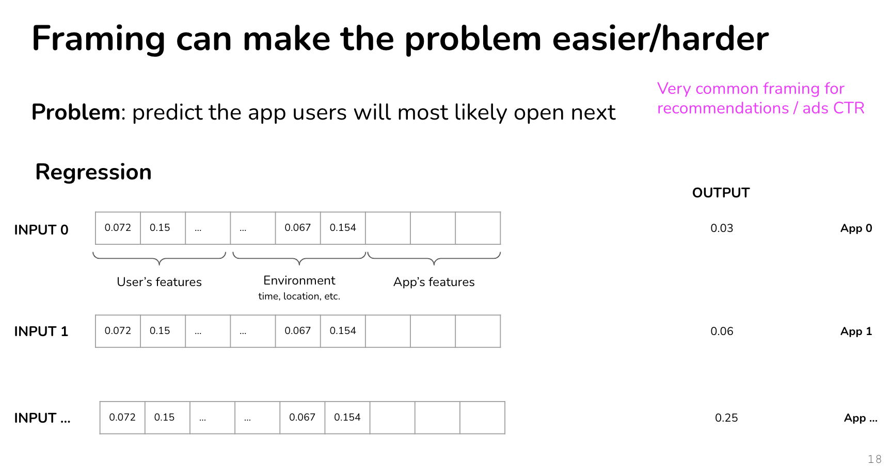
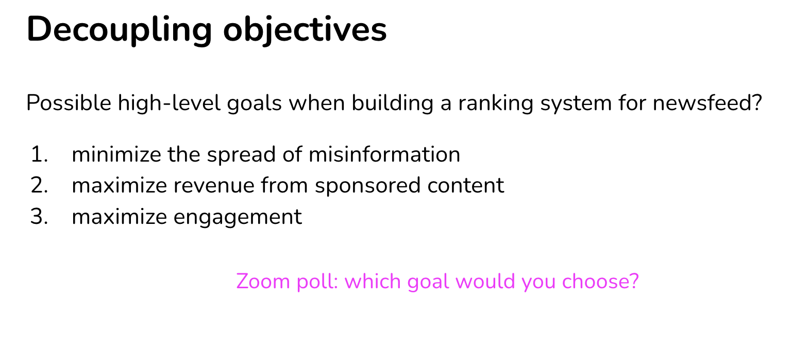

# ML System Fundamentals

</img>

So true!!! It's ... just expectation.

</img>

eda and evaluation 4~17

Project considerations:

1. Framing
2. Objectives
3. Constraints
4. Phases

## Framing

</img>

</img>

</img>

</img>

## framed a problem as different task types

### What app user will most likely open next?

</img>

* frame : multiclass classification
* predict entity - user (哪個 app 會被打開是控制在 output $y$，每次有新增或是刪除app，y就改變，就要重新訓練)
* Every time an app is added/removed, you have to retrain your model (y的維度是常常在變動的)

</img>

* frame : regression
* predict entity - user-app
* 每次新增/刪除app，只會改變 $x$ 的數量，y永遠都是 0 ~ 1

### Example 2(Additional)

### Example 3(Additional)

## ML objectives & Business objective

</img>

</img>

</img>

</img>

</img>

</img>

</img>

</img>

## Phase

</img>

</img>

</img>

</img>

</img>

## Decoupling objective

</img>

</img>

maximize engagement - 標題誘餌、仇恨言論(需要在特別設計)

ref : [Facebook Employee Raises Powered by ‘Really Dangerous’ Algorithm That Favors Angry Posts](https://sfist.com/2020/09/24/facebook-employee-raises-powered-by-really-dangerous-algorithm-that-favors-angry-posts/)

</img>

</img>

</img>

### One Model(with Multiple objective) vs Multiple Model(with single objective)

</img>

quite common in style transfer

[A Neural Algorithm of Artistic Style (Gatys et al, 2017)](https://arxiv.org/pdf/1508.06576.pdf)

# Data Engineering 101

