# Data Engineering / Data Management

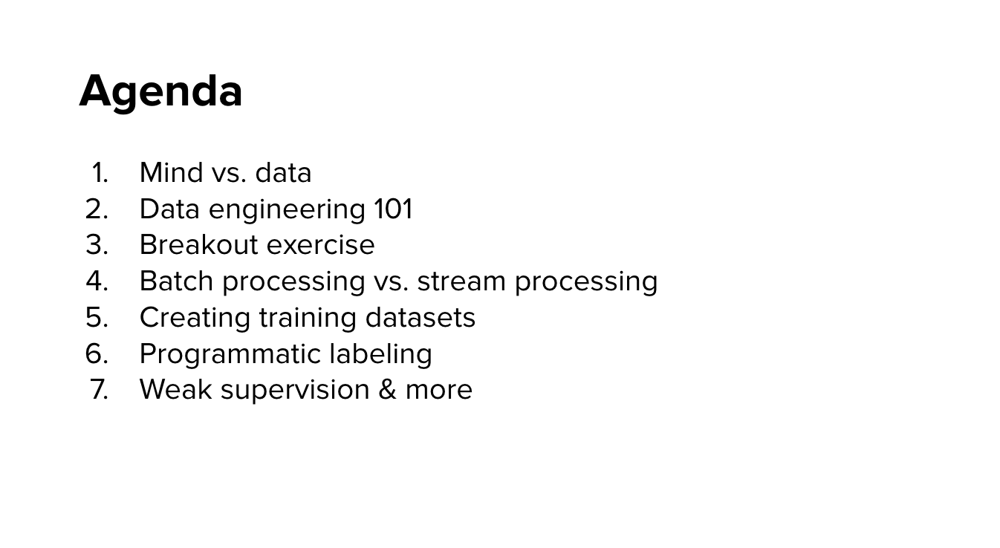</img>

# Mind vs Data

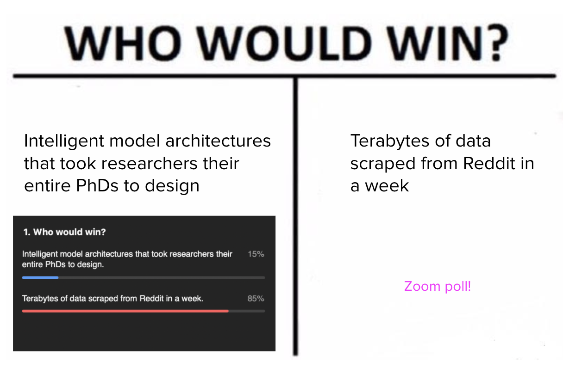</img>

profoundly : 深刻地 adv.

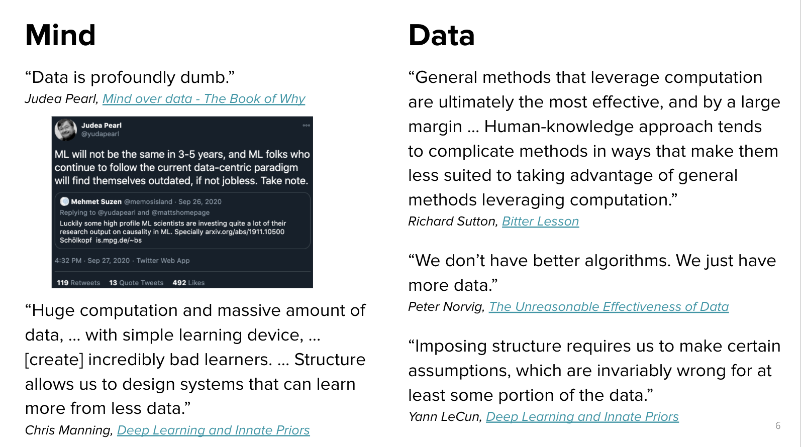</img>

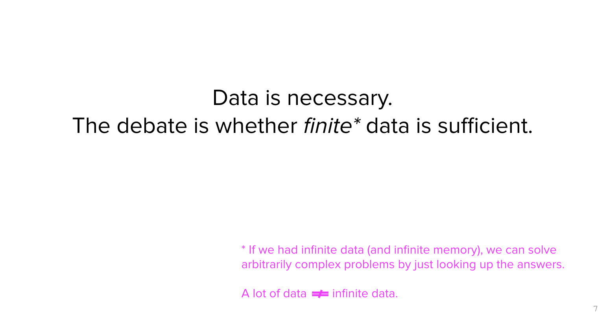</img>

debate : 辯論 n.

# AI Needs

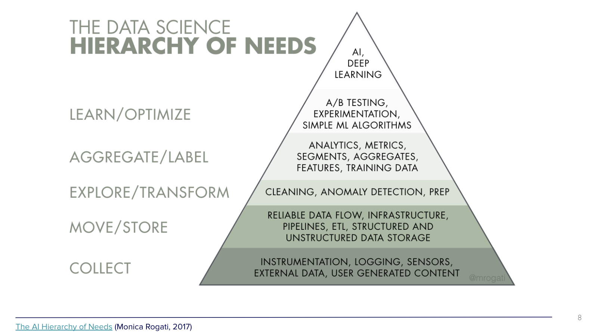</img>

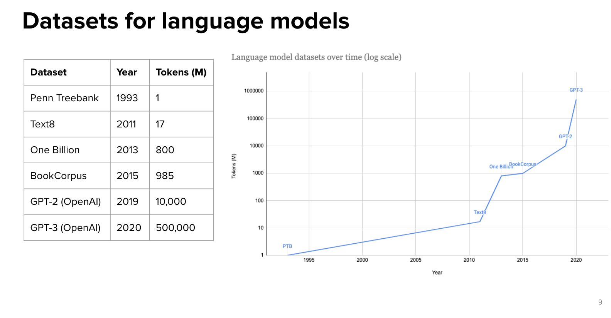</img>

The Moore's Law in AI computation.

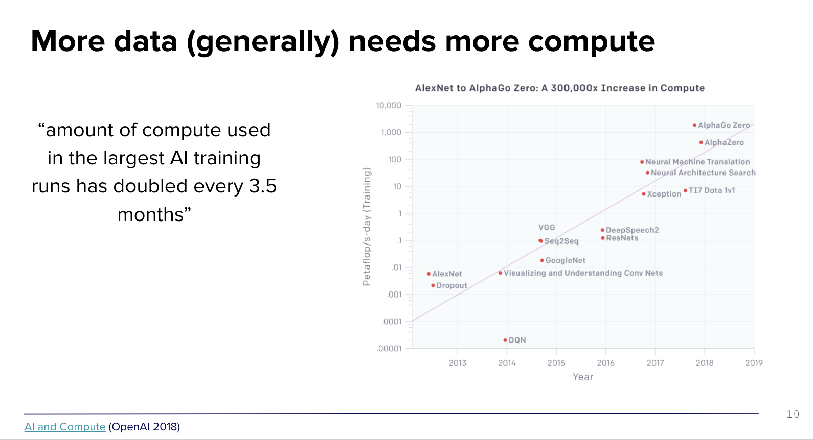</img>

# Data Engineering 101

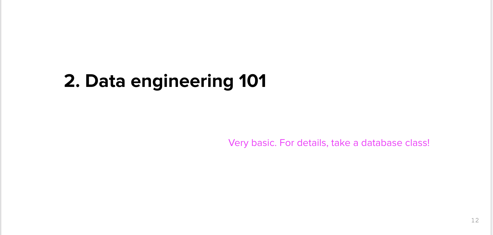</img>

## Data source

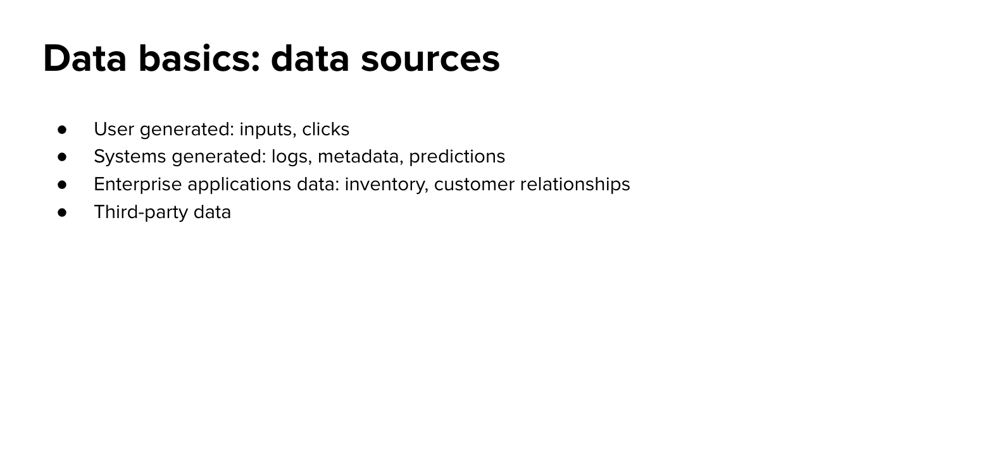</img>

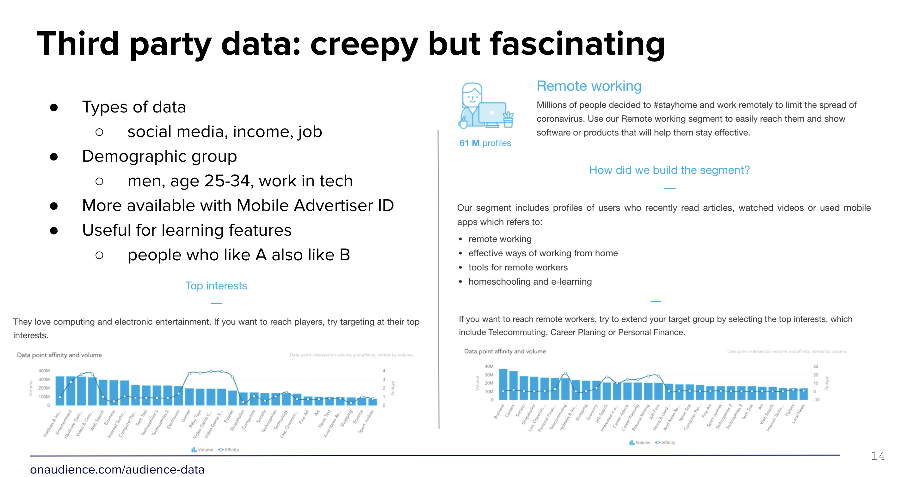</img>

https://www.onaudience.com/audience-data

## format to store

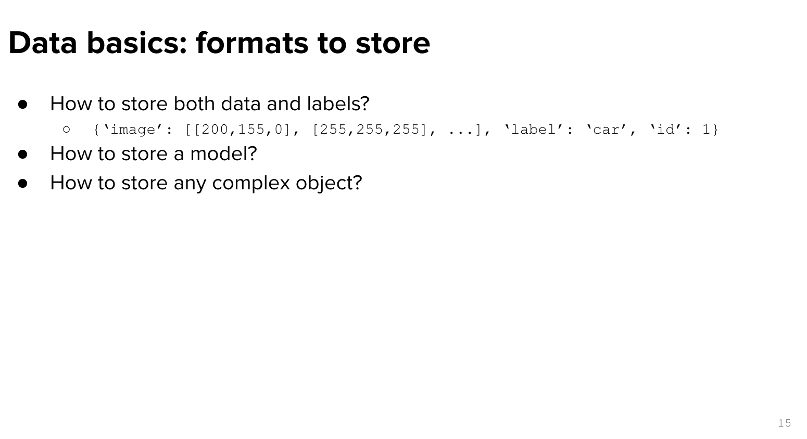</img>

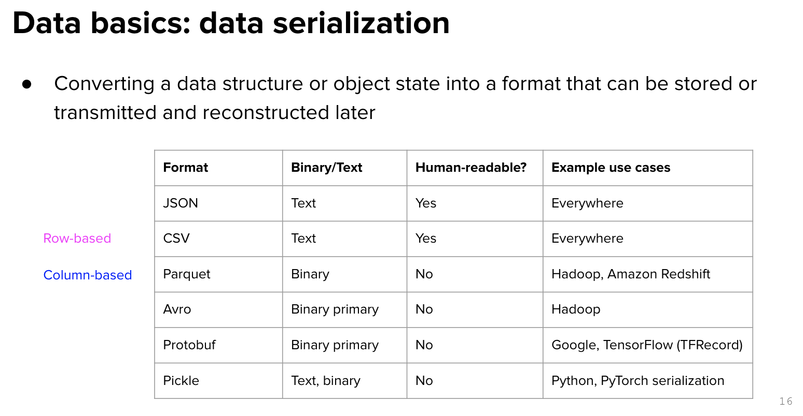</img>

Serialization! 

[Intro to parquet I](https://codertw.com/%E7%A8%8B%E5%BC%8F%E8%AA%9E%E8%A8%80/406598/)

[Intro to parquet II](https://www.itread01.com/content/1520454216.html)

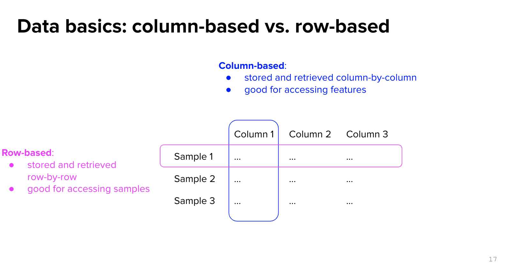</img>

## Column-Based

</img>

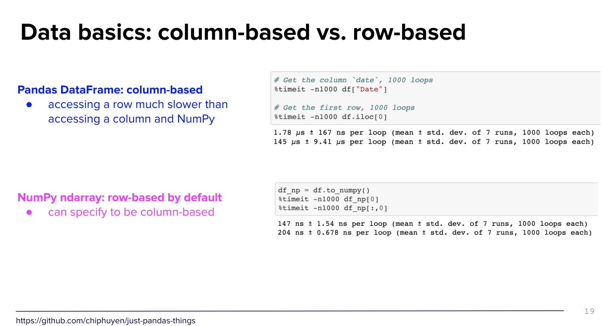</img>

## Row-Based

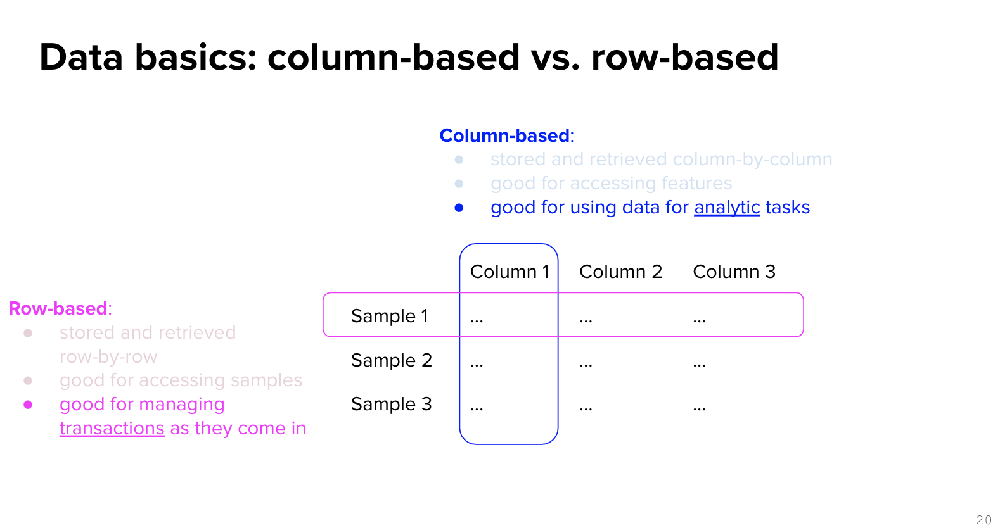</img>

## OLTP & OLAP

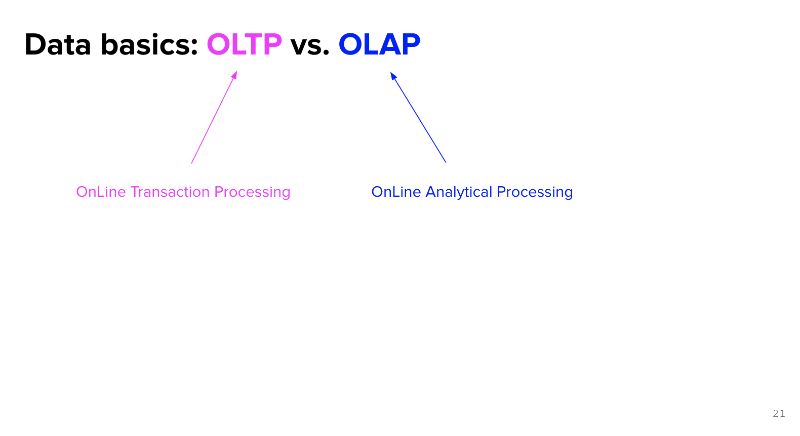</img>
