# Model development and training

</img>

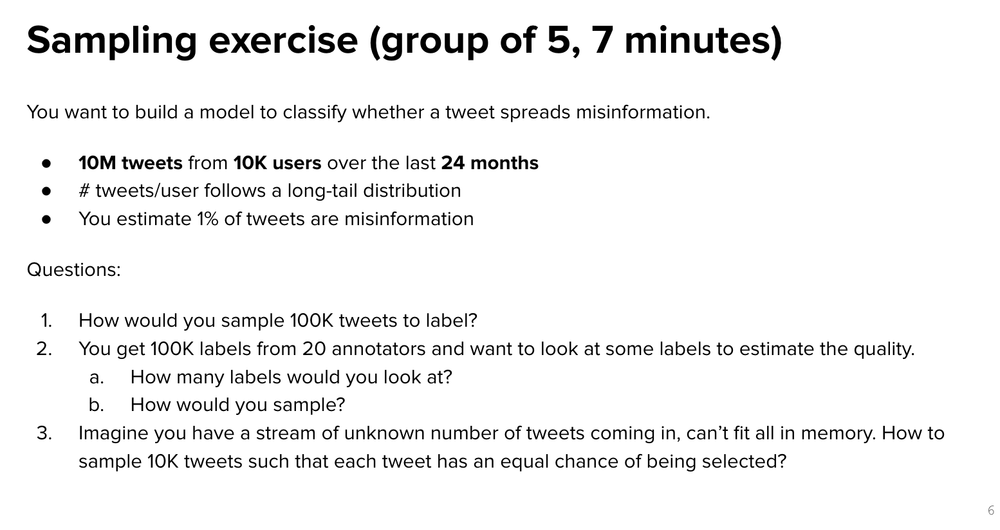</img>

brain stroming : 

QA :

1. 10M x 0.01 = 100K misinformation tweets.

    sampling 1 : 1 true info vs misinformation, 50k, 50k.

2. Do stratified sampling by each annotater, misinformation/true information

   100K / 20 = 5k per labeller, each labeller we stratified sampling, each section we sample 1000 instances.(statistically coverage)

   so I'll sampling (1000+1000) x 20 = 40k instances. to estimate the quality.

3. no idea.

# Sampling

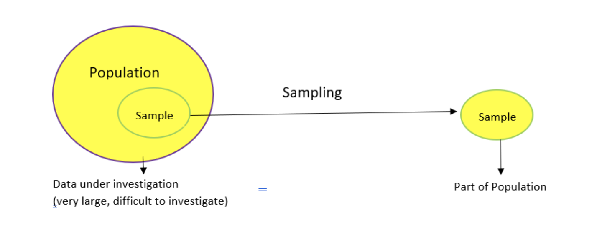</img>

## Non-Probabilistic Sampling

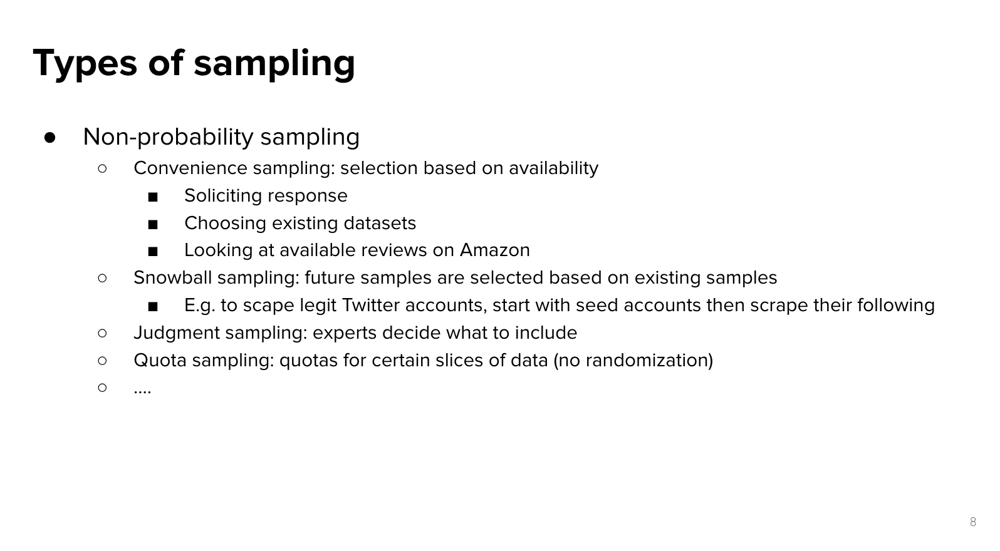</img>

[probabilistic sampling vs non-probabilistic sampiling](https://www.cuhk.edu.hk/soc/lsonline/ies/ies2009/2/electure2_4.htm)

The big problem in ML community!

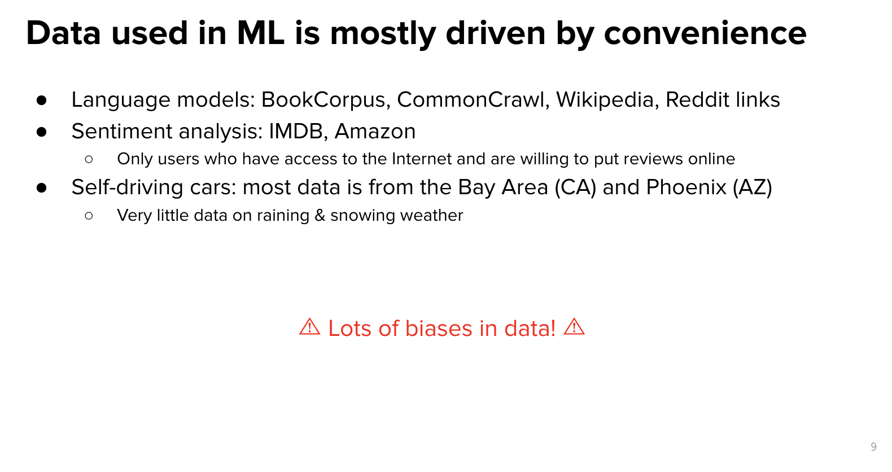</img> - Lots of bias in data!

# Probabilistic Sampling(Random Sampling)

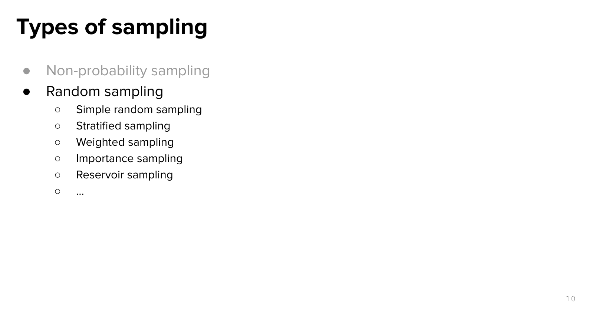</img>

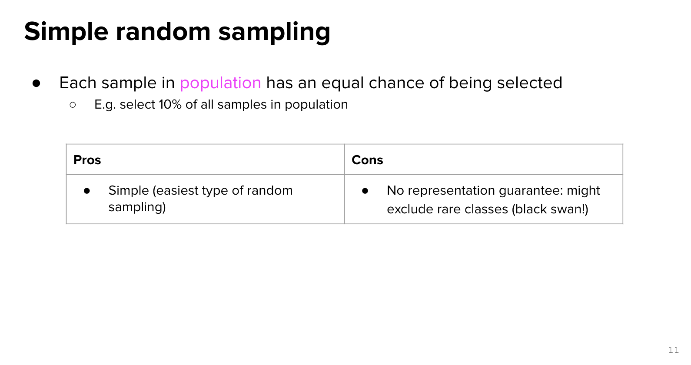</img>

If you just do random sampling, there is a black swam.

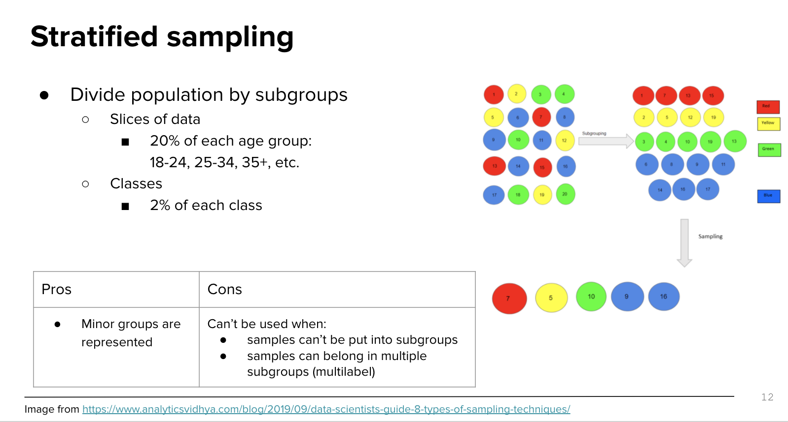</img>

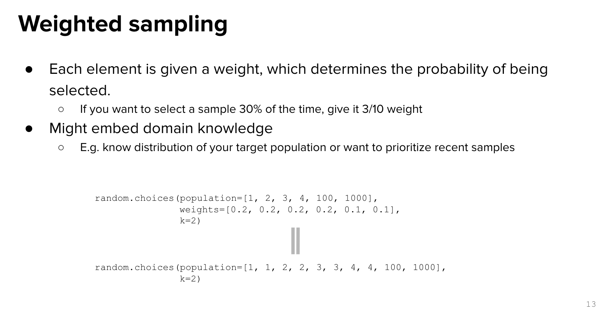</img>

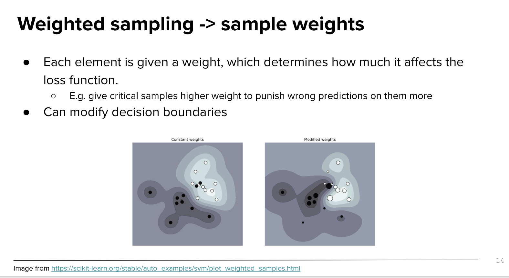</img>

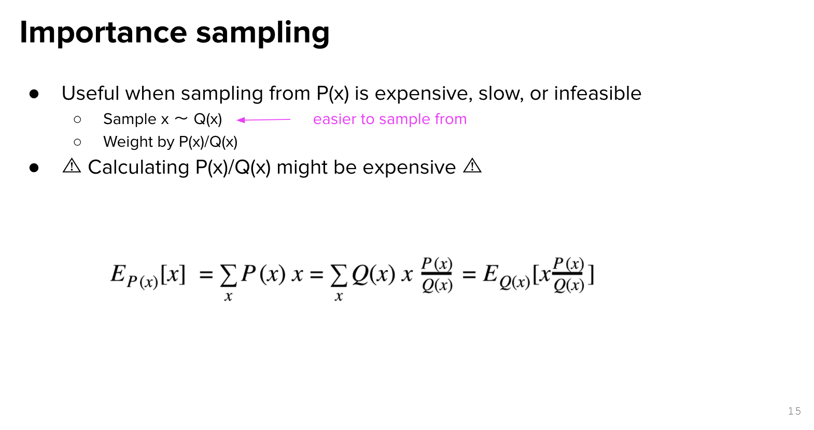</img>

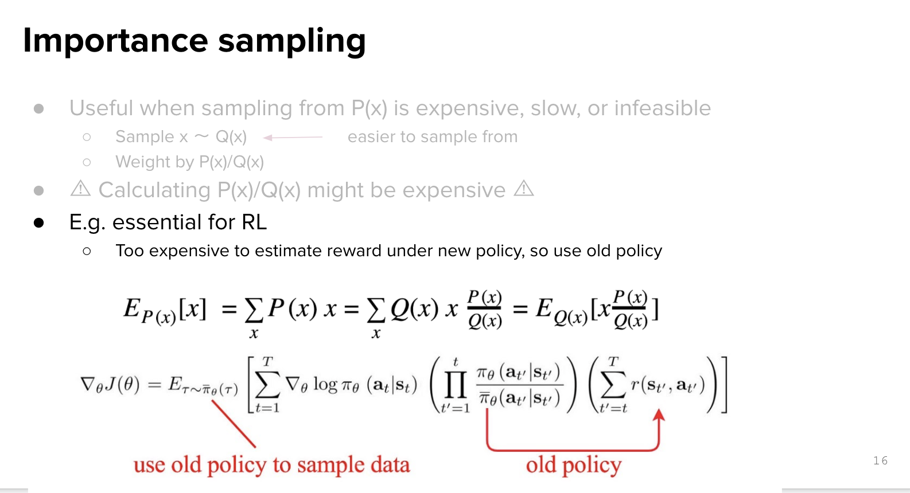</img>

When sampling from original population is infeasible, try sampling from correlated population, then do some math.

[重要性採樣](https://zh.wikipedia.org/zh-tw/%E9%87%8D%E8%A6%81%E6%80%A7%E9%87%87%E6%A0%B7)

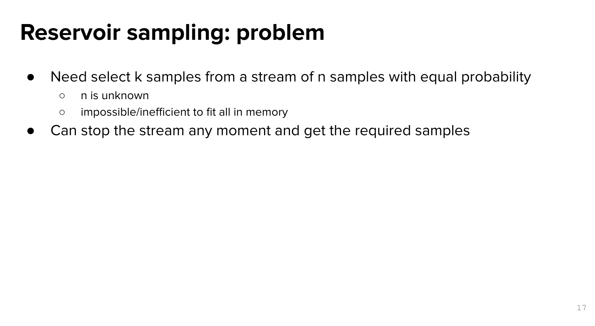</img>

reservior : 水庫(n.)

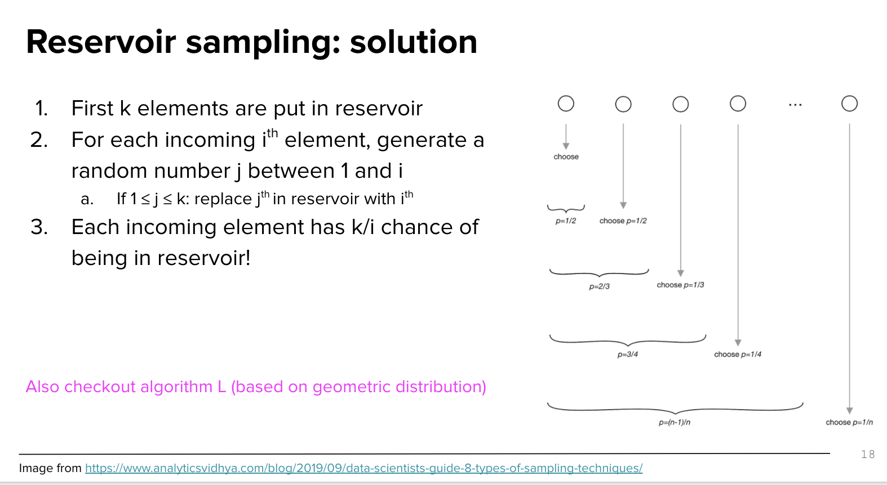</img>

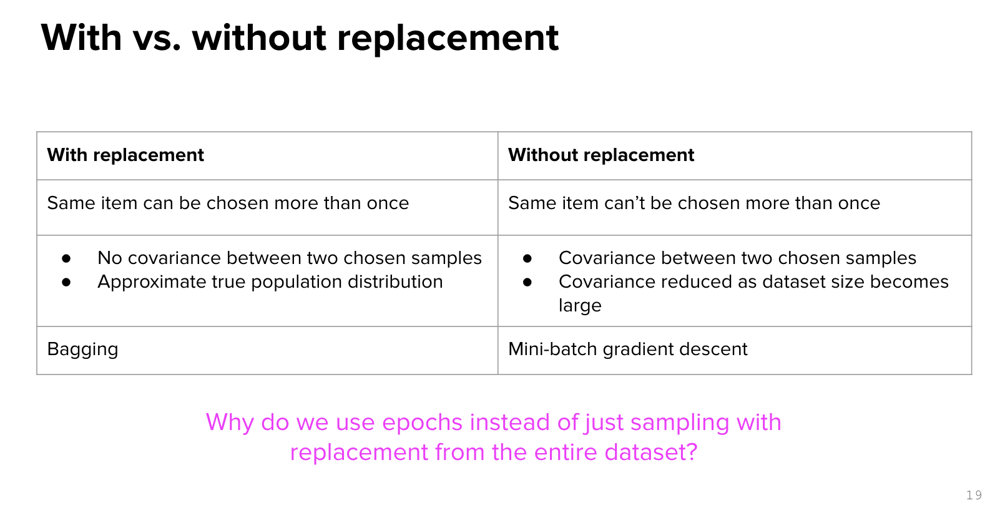</img>

* with replacement - approximate true population, also no covariance between two chosen sample - bagging
* a.k.a. random-forest
* why we train nn without replacement? any experiements compare the two of them?
  + **Because empirically it's converged faster**

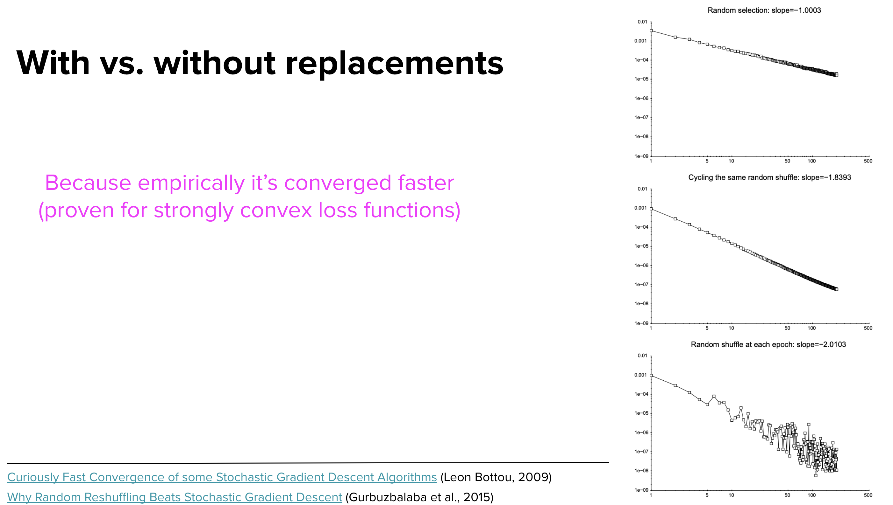</img>

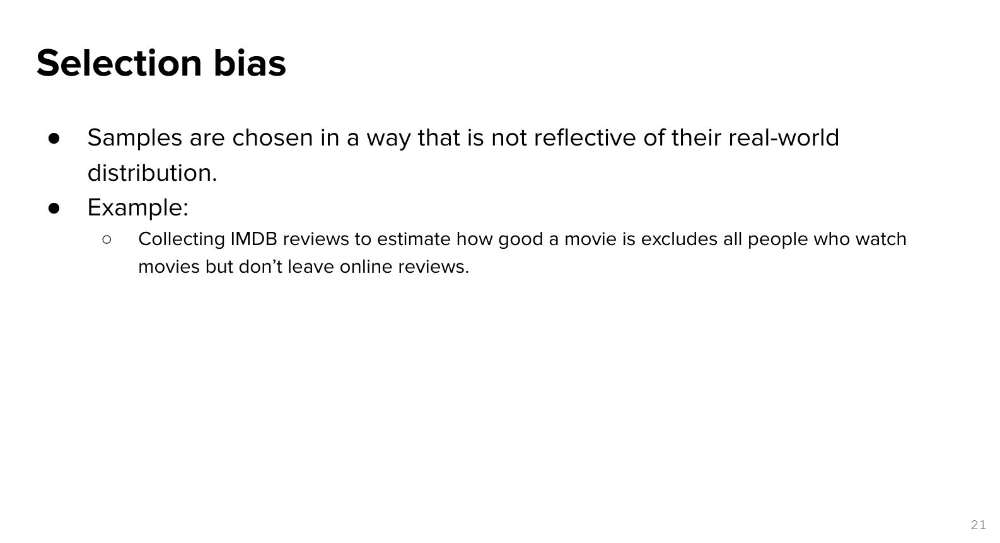</img>

## Sampling SOP

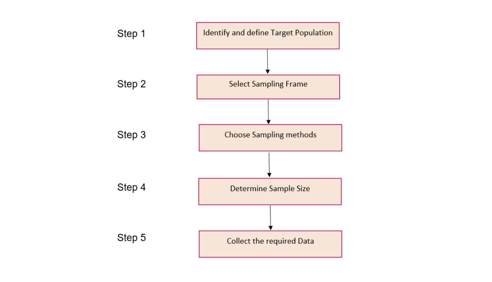</img>

[A Data Scientist’s Guide to 8 Types of Sampling Techniques](https://www.analyticsvidhya.com/blog/2019/09/data-scientists-guide-8-types-of-sampling-techniques/)

# Class Imblance
