# Scaling Up Training 

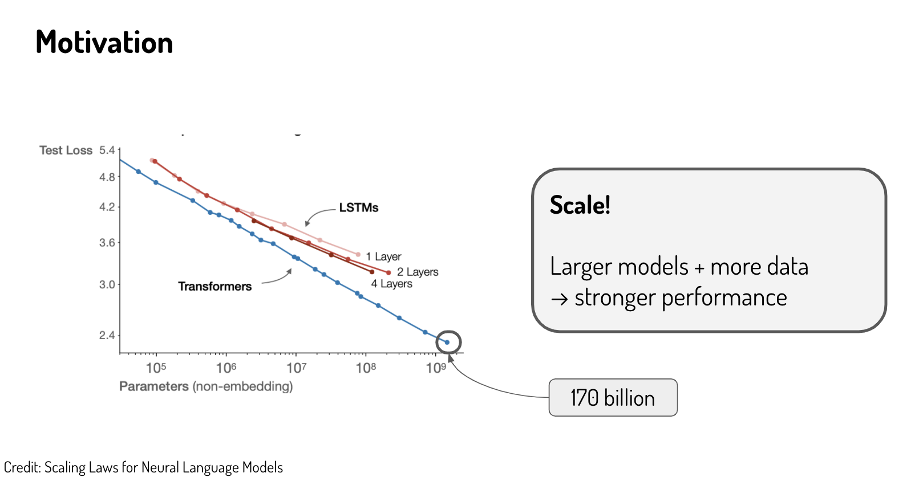</img>

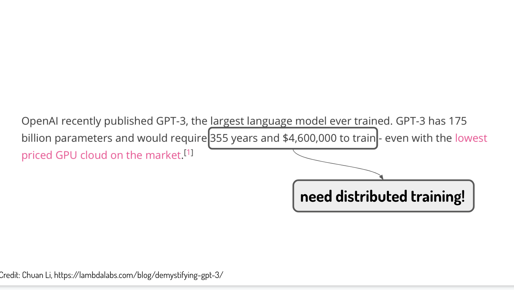</img>

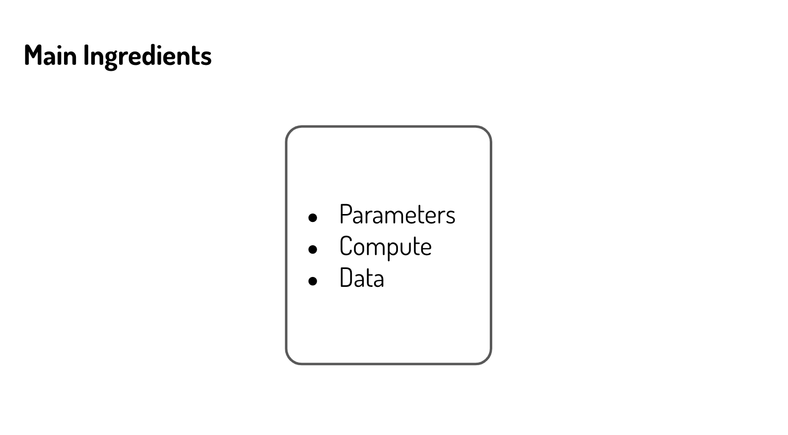</img>

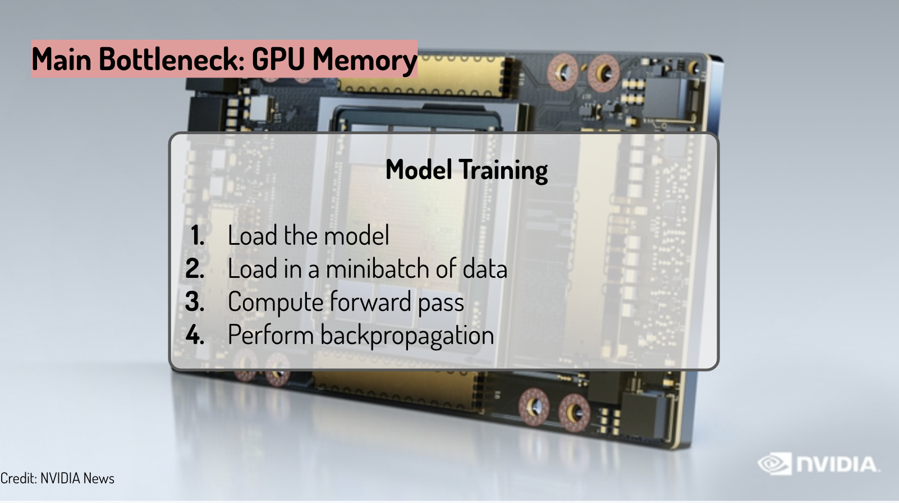</img>

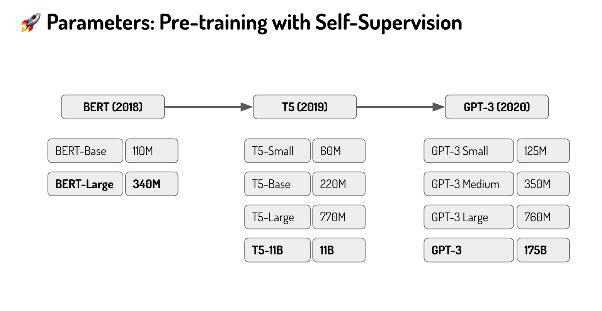</img>

a larger model based on previous one.

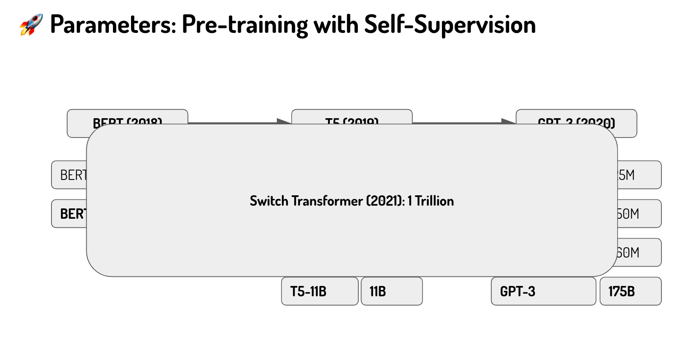</img>

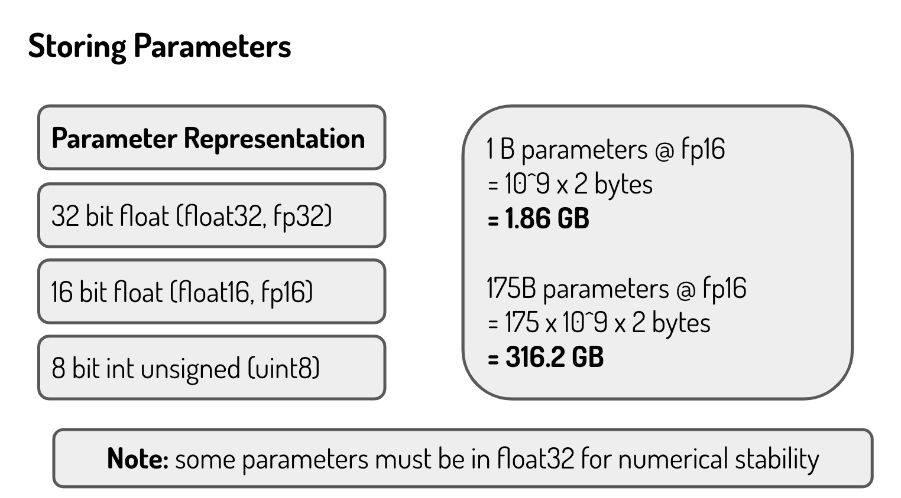</img>

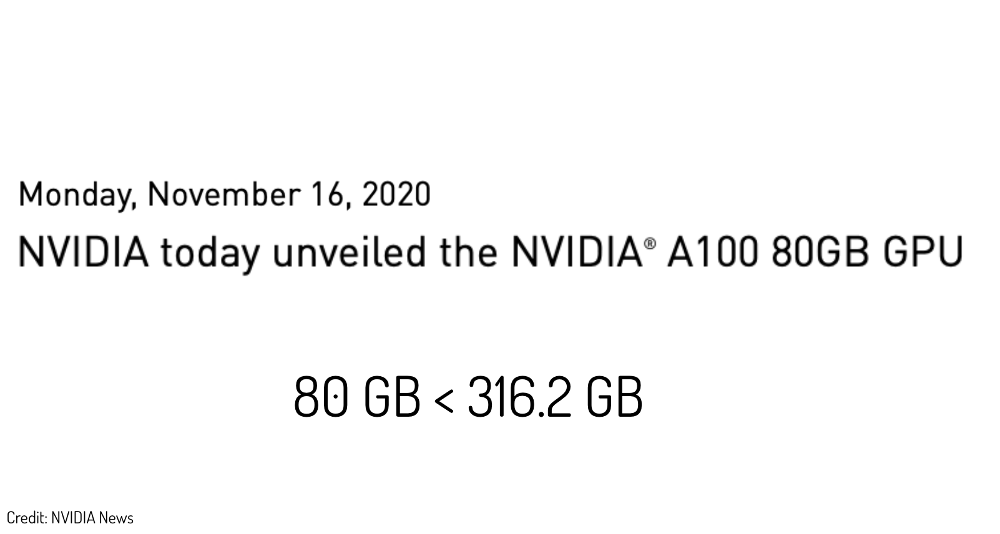</img>

# Mixed-Precision Training 

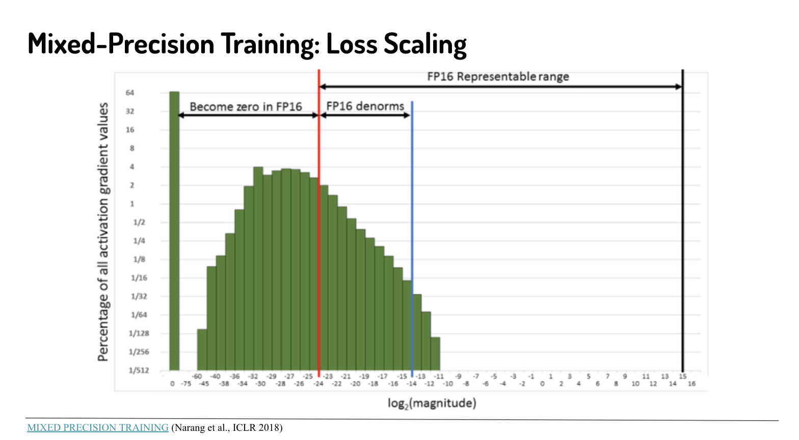</img>

too small part just put them into zero.

[MIXED PRECISION TRAINING](https://arxiv.org/pdf/1710.03740.pdf)

# Distributed

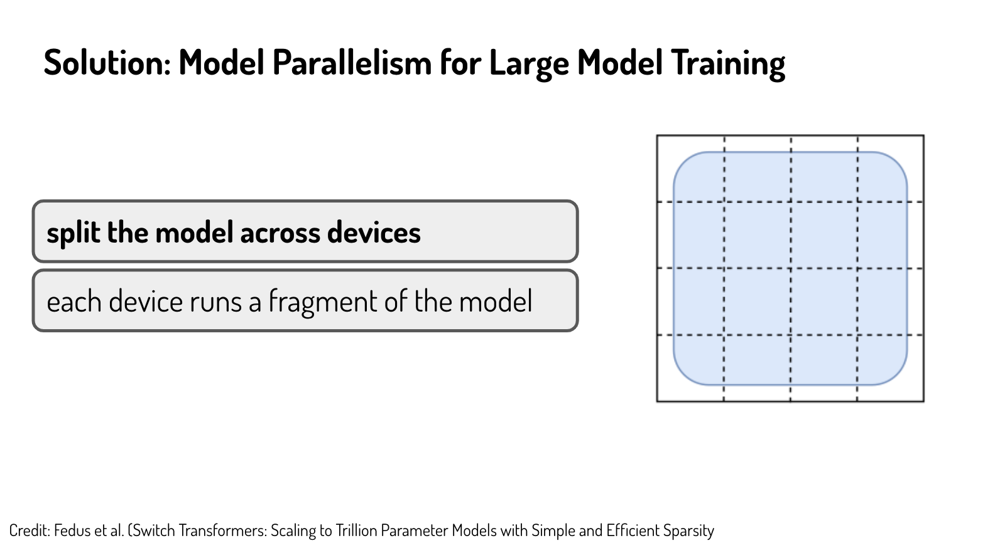</img>

fragment (n.) 分段

# Distributed pipeline or distributed tensor

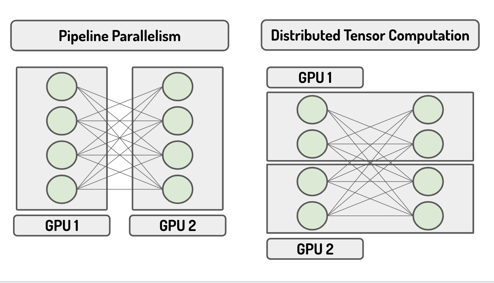</img>

# Storing Activation

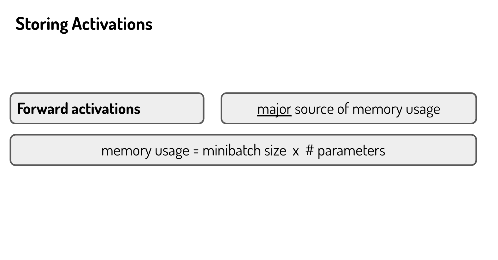</img>

TBD : slide 22

and Pytorch
