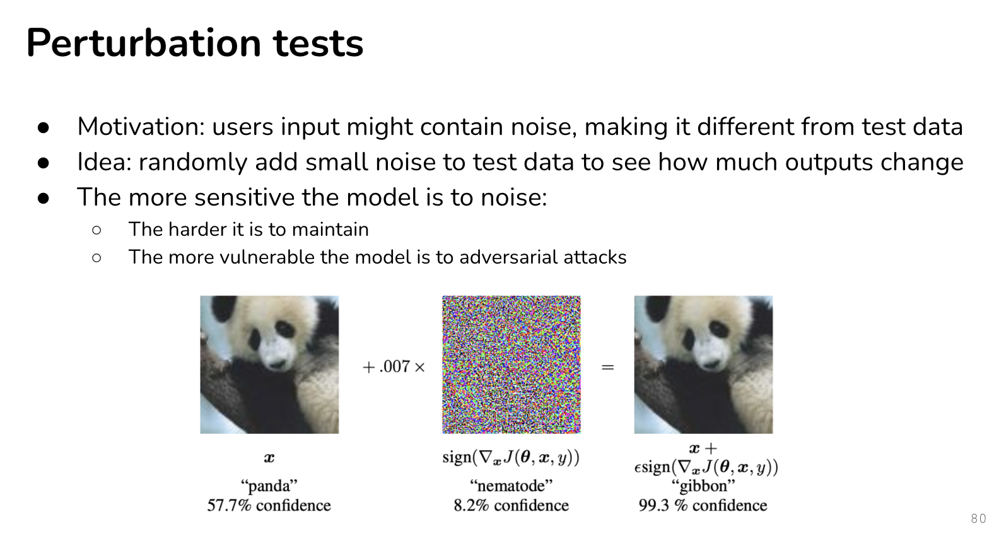
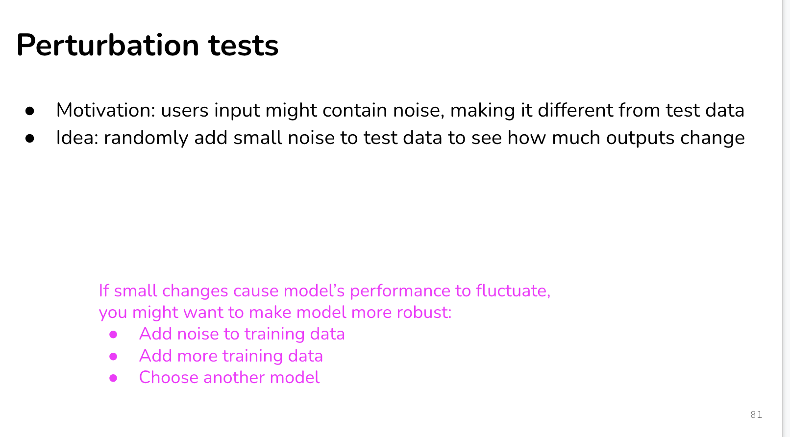
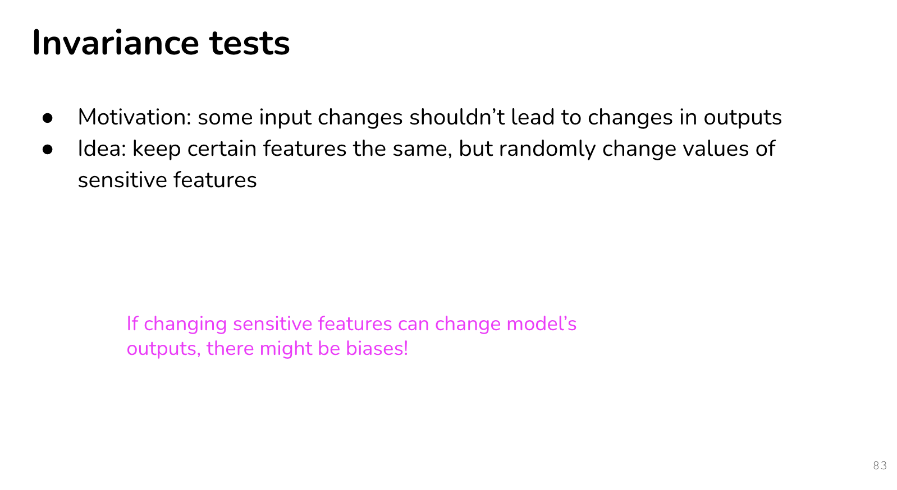
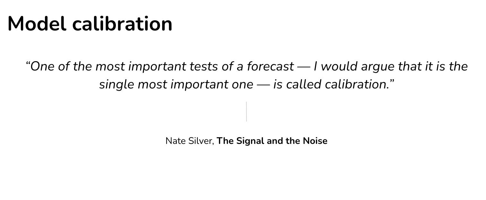
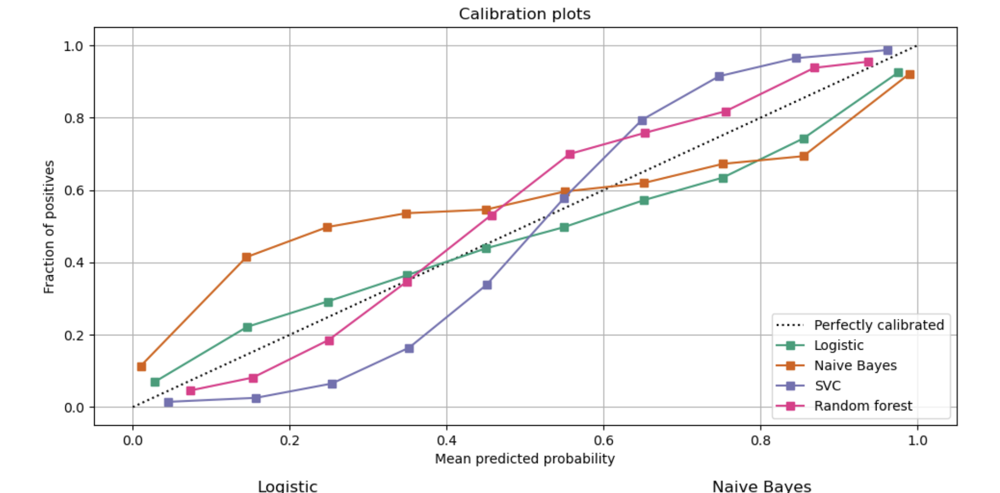
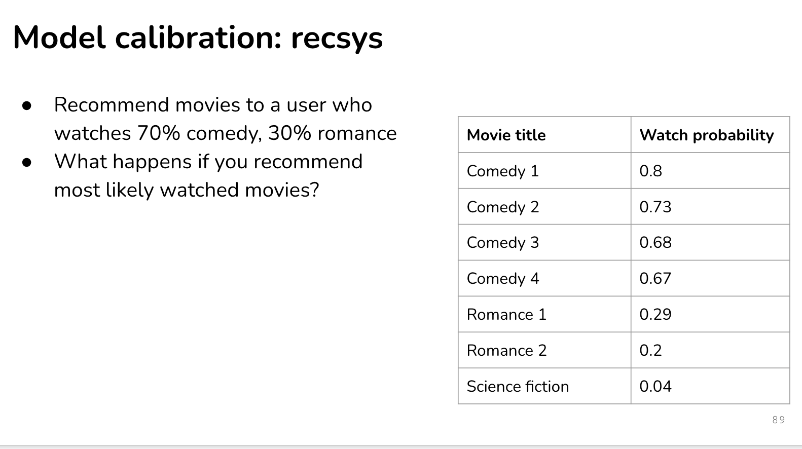
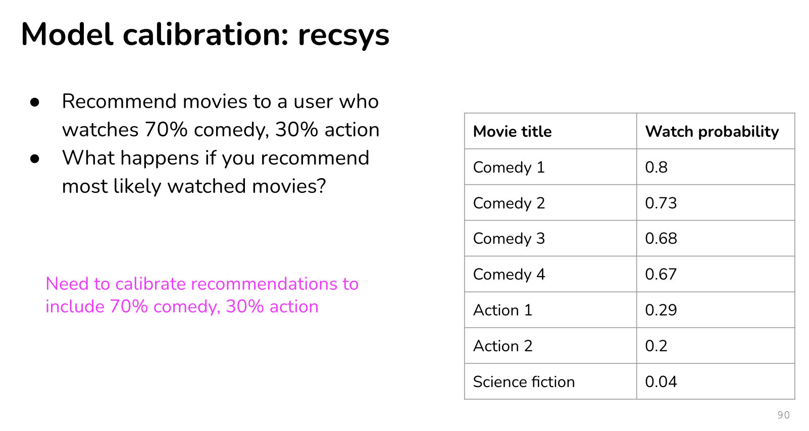
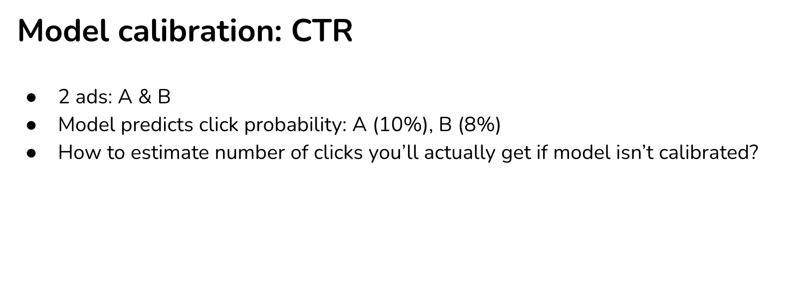
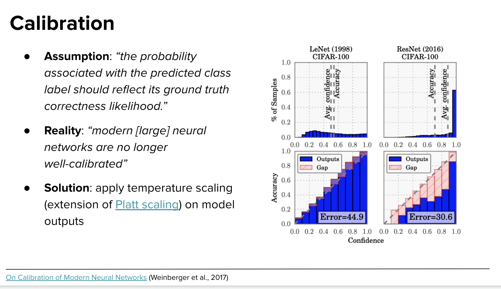

# Offline evaluation

</img>

# Baseline

Task : binary classification, 90% positive, 10% negtive
F1 : 90%

good or bad?

<!-- Naive : all guess positive

suppose 90 positive samples, 10 negtive

ground truth/predict|true|false
-----|-----|-----
positve|true positive(90)|false negtive (0)
negtive|false positive(10)|true negtive (0)

precision (naive) : 90/100 = 0.9
recall (naive) : 90/100 = 0.9

f1 (naive) = $\frac{2PR}{P+R} = \frac{1.8}{1.8} = 1$  -->

baselines:

1. random baseline
   1. predict at random(good benchmark)
      1. uniform
      2. following label distribution
2. zero rule baseline
   1. always predict the most common
3. simple heuristic
   1. classify tweets based on whether they contain links to unreliable sources
4. human baseline
   1. what's human-level performance
5. 3rd api

# Evaluation methods

1. perturbation tests
2. invariance tests
3. directional expectation test
4. model calibration
5. condifence measurement
6. slice-based evaluation

# Perturbation

problem : user input might contain noise, make it different from test data

e.g.

1. Speech recognition: background noise
2. Object detection: different lighting
3. Text inputs: typos, intentional misspelling (e.g. looooooooong, 燒ㄎㄠ ˇ) (in search engine)

Model does well on test set, but fails in production

Idea: randomly add small noise to test data to see how much outputs change

</img>

</img>

# Invariance 

motivation : some input changes shouldn't lead to change in outputs - e.g. race/gender shoun't change predicted approval outcome

</img>

# Directional expectation

motivation : some change to inputs should cause predictable changes in outputs

when predicting housing prices:
* Increasing lot size shouldn’t decrease the predicted price
* Decreasing square footage shouldn’t increase the predicted price

Idea: keep most features the same, but change certain features to see if outputs change predictably

If increasing lot size consistently reduces the predicted price, you might want to investigate why!

# Model calibration

</img>

* if you predict team A wins in A vs B match with 60% prob
  * In 100 A vs B match, A should win 60% of the time
  * **Since we use sigmoid like method to normalized the score, not the fact of probability**

</img>

`Calibration curves (also known as reliability diagrams)`

1. train a classifier(which output prob of binary class)
2. binned prediction with certain binsize
3. predict on a labelled sample set.
4. x as mean predict probability, y as fraction of positive(from ground truth)

dashline - classifier predict as fact.

in the plot

1. Naive Bayes - usually over-estimate when pred-prob < 0.5, under-estimate when pred-prob > 0.5 
2. ...
3. ...

**Need to ensure the top class is correct on average**

[model calibration in sklearn](https://scikit-learn.org/stable/modules/calibration.html)

## Model calibration : recsys

</img>

Q : is user's interest cannnot be influence by your product?

</img>

we can do post-processing, evaluate by CTR to make sure the calibration is right.

## Model calibration : CTR

</img>

## More about calibration : classification

How to do if out model perform poor on calibration curve?

method 1 : add difference after model predict(factors comes from calibration curve)

</img>

extensive calibration method in paper

[On Calibration of Modern Neural Networks](https://arxiv.org/pdf/1706.04599.pdf)

abstract : 

Confidence calibration – the problem of predicting probability estimates representative of the
true correctness likelihood – is important for
classification models in many applications. We
discover that modern neural networks, unlike
those from a decade ago, are poorly calibrated.
Through extensive experiments, we observe that
depth, width, weight decay, and Batch Normalization are important factors influencing calibration. We evaluate the performance of various
post-processing calibration methods on state-ofthe-art architectures with image and document
classification datasets. Our analysis and experiments not only offer insights into neural network learning, but also provide a simple and
straightforward recipe for practical settings: on
most datasets, temperature scaling – a singleparameter variant of Platt Scaling – is surprisingly effective at calibrating predictions.

Lenet is more robust than ResNet =)
