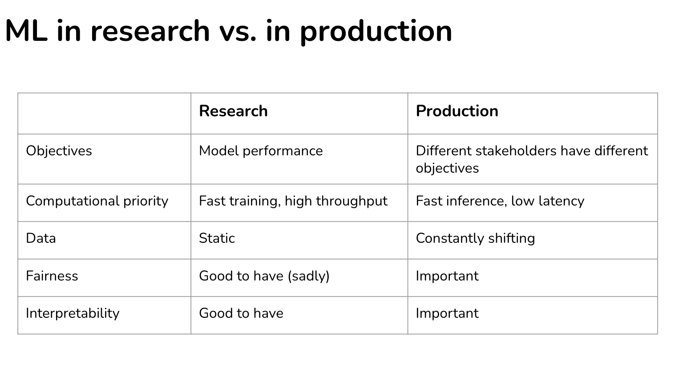

# 2022, Stanford, Winter

[ref](https://stanford-cs329s.github.io/syllabus.html)

> 快速略過每個章節，了解大致重點，並排序優先順序

# Understanding machine learning production

</img>

* 見識一下其他大公司怎麼玩 ML, e.g. 一次部署幾個模型? Booking.com: 150+ models, Uber: thousands
* Cast study : Booking.com 都拿ML模型來幹嘛

# ML and Data Systems Fundamentals

* How to frame your problems? 
  * 單標籤/多標籤/多類別
  * 同樣問題可以用regression解也可以用classification
  * 你的 ML 系統如何與商業指標掛鉤上關係?
* 4 phase to your ML adaption
  * before ml
  * simplest ml
  * optimizing simple models
  * complex models
* decouple objectives
  * pros and cons
* data engineering 101 - olap, oltp, data models, ...
* Designing Twitter's Trending Hashtags Solution

# Training Data

* data cleaness > data volumm (some facts)
* training data always be the bottleneck, there are smoe ways...
  * programmatic labeling
  * weak supervision
  * semi supervision
  * active learning
  * transfer learning
* sampling
  * Simple random,Stratified,Weighted,Importance,Reservoir(sampling in stream)
  * with/wothout replacement
  * dealing with class imbalance

# Feature Engineering

* class imbalance
  * right metrics
  * data-level method
  * algo-level method
* data augmentation
  * most of all -> cv, nlp 
* learned feature vs engineered feature
* common feature engineering
* data leakage

# Model seletion, developement, and training

* data leakage
  * how to split your data
  * type of leakage
* how to engineer good feature
  * feature importance
  * shap
  * the more feautre, the better?
    * overfitting, data leakage, lower inference, tech debts
    * solutions - stable, effective features
    * best pratcies for feature engineering
* model selection
  * SOTA trap - SOTA on research data != SOTA on your data
  * start with simplest - and why
  * uderstand your model's assumption
* ensembles
* automl

# Offline evaluation

* distributed training
  * gpu, cross machine
* offline evaluation
  * random baseline
  * zero rule baseline
  * simple huristics
  * human baseline
* evaluation methods
  * pertubation tests - to avoid data poison
  * invariance tests
  * directional expectation tests
  * model calibrartion
  * confidence measurement
  * slice-based evaluation
    * simpson-paradox

* Case study - recommendation system offline eval

# Deployment

* batch / online
* cloud / edge
* model compression
* compling & optimizing models for edge devices
* how to evaluate mlops tools - tutorial
* deploy models with Ray

# Diagnosis of ML system failures & data distribution shifts & monitoring

* nature labels & feedback loops
* causes of ml failures
* data distribution shifts
* monitoring & observability

TODO